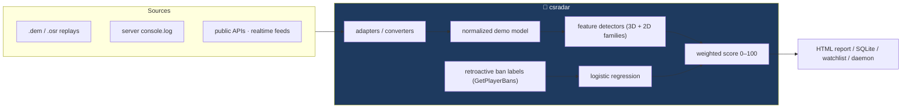
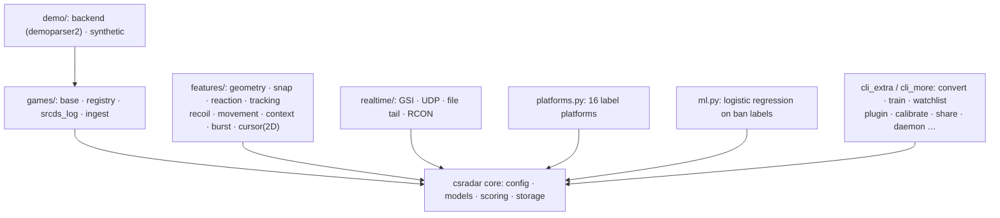
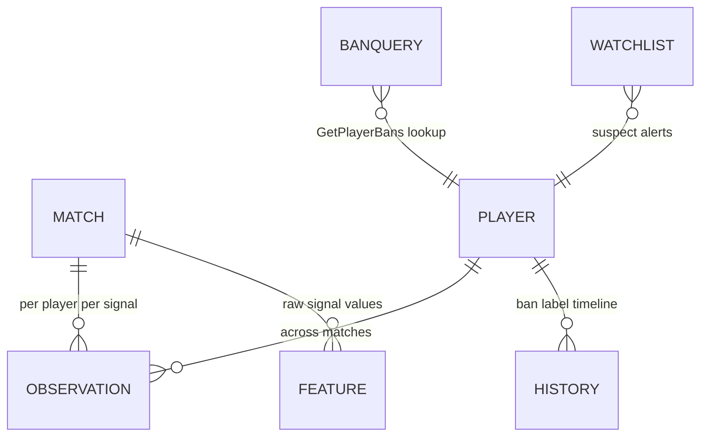
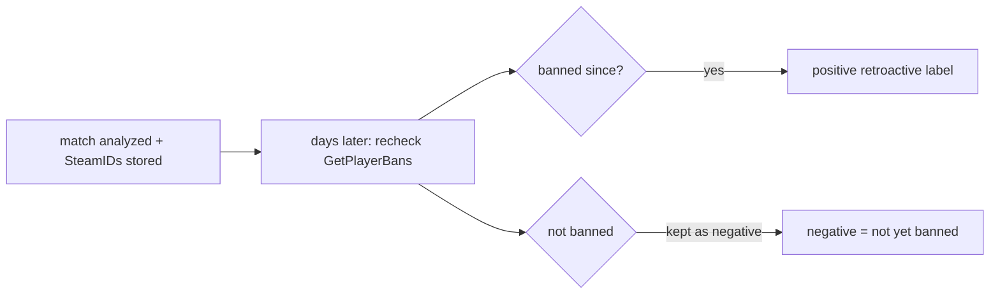
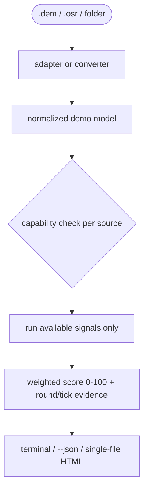
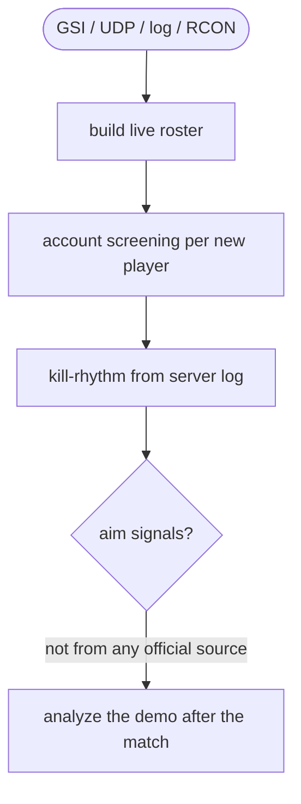
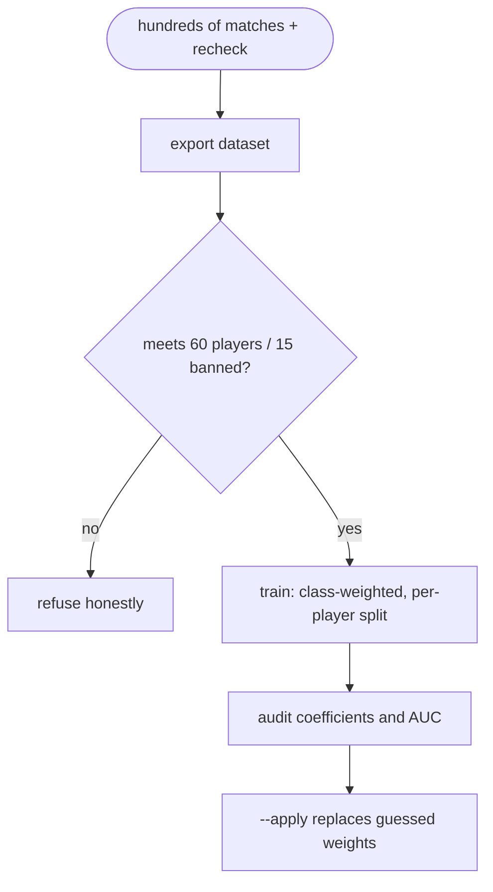
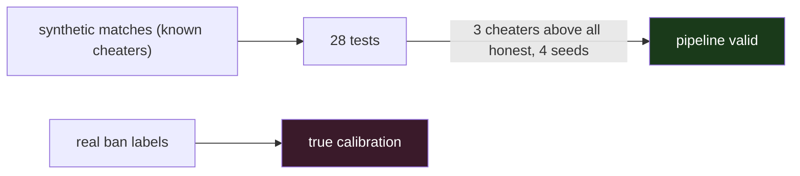

<div align="center">

**🌐 Choose Language / Selecione o Idioma / Elija el Idioma**

[](README.md)&nbsp;&nbsp;&nbsp;[](README_PT.md)&nbsp;&nbsp;&nbsp;[](README_ES.md)

</div>

---

<div align="center">

```
 ██████╗███████╗██████╗  █████╗ ██████╗  █████╗ ██████╗
██╔════╝██╔════╝██╔══██╗██╔══██╗██╔══██╗██╔══██╗██╔══██╗
██║     ███████╗██████╔╝███████║██████╔╝███████║██████╔╝
██║     ╚════██║██╔══██╗██╔══██║██╔══██╗██╔══██║██╔══██╗
╚██████╗███████║██║  ██║██║  ██║██║  ██║██║  ██║██║  ██║
 ╚═════╝╚══════╝╚═╝  ╚═╝╚═╝  ╚═╝╚═╝  ╚═╝╚═╝  ╚═╝╚═╝  ╚═╝
  Cheat suspect screening from replays, server logs and public APIs — without touching any game
```

---

[]()
[]()
[]()
[]()
[]()
[]()

<br/>

> **Screening of cheat suspects — allies and enemies alike — from replays, server logs and public
> APIs, across many games, without ever touching a game process.**
> Aim analysis is **post-match**, on the replay. The realtime module exists and uses only what games
> publish on purpose. This program does not circumvent anticheat, and that is not a setting you can turn on.

<br/>


-8B5CF6?style=flat-square)


</div>

---

## 📑 Table of Contents

<details>
<summary>▶️ <strong>Click to expand / collapse this section</strong></summary>

<table>
<tr>
<td valign="top" width="50%">

**🏗️ System**
- [Overview](#-overview)
- [System Architecture](#-system-architecture)
- [Technology Stack](#-technology-stack)
- [Design Patterns](#-design-patterns-applied)
- [Project Structure](#-project-structure)
- [System Modules](#-system-modules)

**🎮 Coverage**
- [Game Coverage](#-game-coverage--launcher-scanning)
- [Launcher Scanners (23)](#-launcher-scanners-23)
- [Games Outside the List](#-games-outside-the-list)

**🕒 Realtime**
- [Real-Time Sources](#-real-time-sources--four-official-feeds)

</td>
<td valign="top" width="50%">

**🧭 Detection**
- [The Signals — Aim & Behavior Detectors](#-the-signals--aim--behavior-detectors)
- [osu! — Second Native Adapter](#-osu--second-native-adapter)
- [Converters — Bringing Other Games](#-converters--bringing-other-games)
- [Platform Label Sources (16)](#-platform-label-sources-16)

**🧠 Learning**
- [Learning the Weights](#-learning-the-weights)
- [Calibration with Your Own Base](#-calibration-with-your-own-base)
- [Recurrence & Groups](#-recurrence--groups)
- [Sharing Labels](#-sharing-labels-with-other-people)
- [Plugins](#-detectores-yours-plugins)
- [Automation](#-automation)

**💼 Business**
- [Business Rules](#-business-rules)
- [Functional Requirements](#-functional-requirements)
- [Non-Functional Requirements](#-non-functional-requirements)

**📐 Design**
- [Data Model](#-data-model)
- [System Flows](#-system-flows)

**🔐 Security & Ops**
- [Security & Privacy](#-security--privacy)
- [Installation & Execution](#-installation--execution)
- [Automated Tests](#-automated-tests)
- [Metrics & Monitoring](#-metrics--monitoring)
- [Known Limitations](#-known-limitations)

</td>
</tr>
</table>

---

</details>

## 🌟 Overview

<details>
<summary>▶️ <strong>Click to expand / collapse this section</strong></summary>

**cs-cheat-radar** screens for cheat suspects — allies and enemies alike — from **replays, server logs and public APIs**, across many games, without ever touching a game process.

> [!WARNING]
> ## What this program does not do
> It does not circumvent anticheat, and that is not a setting you can turn on.
> To know where other players are and where they are aiming **during** a match, there is only one
> place to get the data: the client's memory. A program that reads there is a wallhack — the same
> calls, the same hooking, the same evasion — no matter what it does with the information afterwards.
> VAC, EAC and Vanguard do not distinguish intent, and the ban is on you.
> That is why aim analysis is **post-match**, on the replay. The realtime module exists (see below)
> and uses only what games publish on purpose.

### 🎯 System Objectives

| Objective | Description |
|-----------|-------------|
| 🎯 **Post-match aim analysis** | View angles from replays only — never from game memory |
| 🎮 **Multi-game** | 541 games catalogued across four coverage levels |
| 🧮 **0–100 score, explainable** | Each signal weighted, each finding reported by round and tick |
| 🧠 **Learns, honestly** | Weights train on real ban labels; refusals below statistical minimums |
| 🔒 **Private by design** | Single-file HTML reports, pseudonymized data sharing, no remote calls |
| 🧪 **Always verified** | 28 tests on synthetic matches with known cheaters |

### ⚖️ Legal & Ethical Limit

This exists to decide **what to watch** and what to report through the **official Valve channels**. Do not use it to publicly accuse anyone based on a number. The output is a **prioritization queue, never a verdict**.

---

</details>

## 🏗️ System Architecture

<details>
<summary>▶️ <strong>Click to expand / collapse this section</strong></summary>

### Data Flow



### Capacity-Based Module Map



The central piece is the **normalized demo model** in `models.py`: every game and format lands in the same schema, independent of the parser that fed it — which is what lets one detector pipeline serve every game.

---

</details>

## 🛠️ Technology Stack

<details>
<summary>▶️ <strong>Click to expand / collapse this section</strong></summary>

| Layer | Technology | Purpose |
|-------|-----------|----------|
| 🧠 **Language** | Python 3.10+ (tested on 3.14) | Everything |
| 📦 **Baseline install** | Pure stdlib | `pip install -e .` — synthetic mode works with zero extras |
| 🎮 **Demo parsing** | demoparser2 0.42 (polars) | Reading real `.dem` files; adapter accepts polars and pandas |
| 🗄️ **Storage** | SQLite | No server, no infra |
| 📄 **Reports** | Single self-contained HTML file | No CDN, no remote font, opens in a year and leaks nothing |
| 🧠 **ML** | Pure-Python logistic regression | Auditable in one sitting; refuses below minimum sample |
| 🏗️ **osu! replay** | LZMA "alone" from the stdlib | Native `.osr` reader/writer with **zero dependencies** |
| 🔌 **Over the wire** | `urllib` for Steam API | No `requests` dependency at all |
| 🎲 **Synthetic data** | `demo/synthetic.py` | Matches with known cheaters, for tests and self-checks |

---

</details>

## 📐 Design Patterns Applied

<details>
<summary>▶️ <strong>Click to expand / collapse this section</strong></summary>

| Pattern | Where | Rationale |
|---------|-------|-----------|
| 🤝 **Capability model** | Every source declares what its data sustains (`games/base.py`) | No source ever claims more than its data delivers — enforced by two tests |
| 🔌 **Adapter backend** | `demo/backend.py` normalizes demoparser2 → internal model | Parsers can be swapped; detectors never know the format |
| 🧩 **Plugin contract** | `REQUIRES` / `PRODUCES` / `analyze(...)` | User detectors share the internal contract; a mature plugin moves into the core without rewrite |
| 🛡️ **Honest refusal** | Lattice-style checks: insufficient samples, missing data, low class count | A refused computation is reported as such, never as a number |
| 📤 **Pseudonymized sharing** | SteamID → HMAC with random salt | Sharing raw signals without ever sharing identity |
| 🏗️ **Capability-gated detectors** | `pitch`/`yaw` absent → aim signals silently skip, report says so on line one | Missing data never produces a wrong conviction |

---

</details>

## 📁 Project Structure

<details>
<summary>▶️ <strong>Click to expand / collapse this section</strong></summary>

```
cs-cheat-radar/
│
├── 📂 csradar/
│   ├── config.py        detection parameters (JSON in ~/.csradar/config.json)
│   ├── models.py        normalized demo model, parser-independent
│   ├── scoring.py       combines signals into a 0-100 score
│   ├── report.py        terminal output
│   ├── storage.py       SQLite: matches, observations, ban queries
│   ├── steam.py         Web API, SteamID conversion, risk profile
│   ├── live.py          console.log tail + `status` parsing
│   ├── labeling.py      retroactive label and precision/recall
│   ├── cli.py           command line interface
│   ├── cli_games.py     games / scan / ingest / realtime commands
│   ├── catalog.py       23 launcher scanners (text and binary VDF, registry)
│   ├── ml.py            logistic regression over ban labels
│   ├── htmlreport.py    report in a single file
│   ├── watchlist.py     recurrence and folder watcher
│   ├── platforms.py     16 label platforms (6 keyless)
│   ├── cli_extra.py     convert / train / watchlist / daemon / platform / doctor
│   ├── cli_more.py      calibrate / history / explain / rings / recurring /
│   │                    share / plugins / selftest / prune
│   ├── analytics.py     percentile calibration, recurrence, groups, prune
│   ├── sharing.py       pseudonymized dataset exchange between users
│   ├── plugins.py       user detectors, loaded from a folder
│   │
│   ├── 📂 games/
│   │   ├── base.py          capabilities: what each source can deliver
│   │   ├── registry.py      game catalogue and support level
│   │   ├── srcds_log.py     Source dedicated server log
│   │   ├── ingest.py        normalized JSON/JSONL/CSV format
│   │   ├── converters.py    PUBG, r6-dissect and generic mapper
│   │   └── osu_replay.py    .osr reader and writer (native, stdlib)
│   │
│   ├── 📂 realtime/
│   │   ├── sources.py       GSI, log UDP, file tail, RCON
│   │   └── engine.py        live roster, alerts, snapshot
│   │
│   ├── 📂 demo/
│   │   ├── backend.py       demoparser2 adapter → normalized model
│   │   └── synthetic.py     matches with known cheaters
│   │
│   └── 📂 features/
│       ├── geometry.py      angles in Source convention (positive pitch = down)
│       ├── snap.py          angular snap and residual jitter
│       ├── reaction.py      reaction time
│       ├── tracking.py      wallhack proxy and pre-aim
│       ├── recoil.py        recoil control across a burst
│       ├── movement.py      silent aim and non-human entry
│       ├── context.py       kills through smoke/wall
│       ├── burst.py         kill rhythm (event-only sources)
│       └── cursor.py        2D family: tremor, cursor jump, key timing
│
├── 📂 tests/test_csradar.py  # 28 tests, no network, no demoparser2
├── 📄 MANUTENCAO.md          # what was deliberately NOT built, safety rules
├── 📄 README.md              # 🇺🇸 English (primary)
├── 📄 README_PT.md           # 🇧🇷 Português
└── 📄 README_ES.md           # 🇪🇸 Español
```

See also `MANUTENCAO.md`: what was deliberately not built, where it is safe to touch, and the rules that must not be relaxed.

---

</details>

## 📦 System Modules

<details>
<summary>▶️ <strong>Click to expand / collapse this section</strong></summary>

| Module | Responsibility |
|--------|----------------|
| `csradar/` core | Config, normalized model, scoring (0–100), terminal output, SQLite storage |
| `steam.py` | Steam Web API, SteamID conversion, account risk profile |
| `live.py` | Tail of `console.log` + parsing of `status` |
| `labeling.py` | Retroactive label from future bans; precision/recall against them |
| `catalog.py` | 23 launcher scanners — text/binary VDF, registry, JSON, SQLite |
| `games/` | Support registry (541 games), source capabilities, srcds log, ingestion |
| `realtime/` | GSI, log UDP, file tail, RCON — live roster, alerts, snapshot |
| `demo/` | demoparser2 adapter + the synthetic match generator |
| `features/` | 3D aim detectors (snap, jitter, reaction, tracking, prefire, recoil, movement, context, burst) and the 2D family (tremor, cursor_jump, key_timing) |
| `ml.py` | Logistic regression over ban labels, class-weighted, per-player split |
| `htmlreport.py` | Single-file HTML report, watcher hits, no remote resources |
| `watchlist.py` | Recurrence, folder watch, daemon |
| `platforms.py` | 16 label platforms, 6 without any key |
| `sharing.py` | Pseudonymized dataset export/import (HMAC + salt) |
| `plugins.py` | User-written detectors loaded explicitly from a folder |
| `analytics.py` | Percentile calibration, recurrence, rings, prune |
| CLI layers | `cli.py` + `cli_games.py` + `cli_extra.py` + `cli_more.py` |
| Tests | `tests/test_csradar.py` — 28 tests, no network, no demoparser2 |

---

</details>

## 🎮 Game Coverage & Launcher Scanning

<details>
<summary>▶️ <strong>Click to expand / collapse this section</strong></summary>

**541 games catalogued.** `csradar games` classifies each into four levels, and the level determines which signals run:

| level | what exists | signals available |
|---|---|---|
| **complete** | replay with per-tick view angles | all |
| **positional** | per-tick positions, no aim | partial |
| **events** | only kills and rounds | kill rhythm (weak) |
| **account** | no readable replay | account risk and retroactive ban only |

Current distribution: **51 complete, 11 positional, 167 events, 312 account.**

CS2 and osu! are the only ones with a **native** adapter. Everything else at complete level arrives via external converter + `csradar ingest`, and there are many: the whole GoldSrc family (CS 1.6, CS:S, Condition Zero, TFC, DoD, HLDM, Ricochet, Deathmatch Classic), the id tech family (Quake 1/2/3/4, QuakeWorld, DOOM, OpenArena, Xonotic, Warsow, Urban Terror, RTCW, Wolf:ET, SoF2, Jedi Academy, Call of Duty 2 and 4), the Cube games (Sauerbraten, Red Eclipse, AssaultCube), Unreal Tournament 99/2004, Teeworlds/DDNet, TF2 and Rocket League. These formats record the input command per frame — and the command includes the view angle, which is exactly what the aim detectors need.

Positional: Dota, Deadlock, osu!/osu!lazer, Trackmania, World of Tanks/Warships, UT3, CS2D, Beat Saber and Fortnite's local `.replay`. Events: dedicated Source and GoldSrc servers (with a generic entry for any game of each engine), Siege, the Relic and Blizzard RTS, Rust, Squad, Arma, DayZ, ARK, WoW, PlanetSide, EVE, Killing Floor, Sandstorm, Battlefield 3/4/Hardline via community server RCON, FiveM/SA-MP/MTA and the survival crowd with RCON.

VALORANT, Apex, CoD, Overwatch, Tarkov, Roblox and company stay at **account** — not out of laziness, but because the industry closed replays precisely to hinder cheating, and the side effect is closing independent analysis too. Two tests lock this: no game with kernel-level anticheat can promise more than `account`, and no game can declare complete/positional without naming the adapter or converter that delivers the data.

If a game exports replay or log in any format, convert it and feed the ingestion format (`csradar games --spec`): JSON, JSONL or CSV. What you provide determines what runs — without per-tick `pitch`/`yaw` the aim signals simply do not execute, and the report says on the first line what was left out. A low score on a poor source does not mean the player is clean, and the program repeats that on output so you are not misled.

---

</details>

## 📋 Launcher Scanners (23)

<details>
<summary>▶️ <strong>Click to expand / collapse this section</strong></summary>

`csradar scan` enumerates installed titles, each with its own format:

| platform | how |
|---|---|
| Steam | `libraryfolders.vdf` + `appmanifest_*.acf` (own KeyValues parser) |
| Epic | `.item` JSON manifests |
| Legendary/Heroic | `installed.json` (alternative Epic client, Linux) |
| GOG Galaxy | registry + `galaxy-2.0.db` (SQLite, read-only) |
| Xbox / Game Pass | `.GamingRoot` on each drive root + `AppxManifest.xml` |
| Battle.net | `Battle.net.config` (JSON) |
| Riot | `RiotClientInstalls.json` |
| EA / Origin | `LocalContent` + `EA Desktop/InstallData` |
| Ubisoft | Ubisoft Launcher registry |
| Rockstar | Rockstar Games registry |
| Amazon Games | `GameInstallInfo.sqlite` |
| itch.io | `butler.db` (SQLite) |
| Lutris | `pga.db` (SQLite, Linux) |
| Heroic | `installed.json` from Epic, GOG and Amazon |
| Meta / Oculus | JSON manifests + `Oculus/Software` (VR catalogue) |
| Wargaming | Game Center `preferences.xml` |
| Minecraft | existence of `.minecraft` — the launcher keeps no inventory |
| Roblox | `Roblox/Versions` |
| non-Steam shortcuts | `shortcuts.vdf` (**binary** VDF, own parser) |
| Flatpak | `/var/lib/flatpak/app` and the user one (Linux) |
| Snap | `/snap` (Linux) |
| known folders | Riot, Battlestate, HoYoPlay, Nexon, NCSOFT, Garena, NetEase, Oculus, Epic, EA |
| Uninstall registry | safety net for everything that has an uninstaller |

> [!NOTE]
> Steam is also searched on Linux and macOS paths. A scanner that breaks (corrupted launcher, locked database, denied permission) does not bring the sweep down — the error is recorded and the rest continues.

---

</details>

## 📉 Games Outside the List

<details>
<summary>▶️ <strong>Click to expand / collapse this section</strong></summary>

> Merged into the coverage section — see [Game Coverage](#-game-coverage--launcher-scanning) and [Converters](#-converters--bringing-other-games). The ingestion format (`csradar games --spec`, `csradar ingest`) accepts JSON, JSONL or CSV; every converter declares only the capabilities the data truly sustains.

---

</details>

## 🕒 Real-Time Sources — Four Official Feeds

<details>
<summary>▶️ <strong>Click to expand / collapse this section</strong></summary>

This program maintains the roster live, kicks off account screening for each player as soon as they appear, and runs the kill-rhythm signal when there is a server log. **Aim analysis does not run live** — other players' view angles are not in any official source. When the match ends, analyze the demo.

| source | what it delivers | requires |
|---|---|---|
| `--udp host:port` | full live events | dedicated server **yours** (`logaddress_add`) |
| `--log file` | the same, reading the log from disk | access to the log |
| `--gsi` | scoreboard, round, roster while observing | no `-condebug`; a GSI config (`--install-gsi`) |
| `--rcon host:port:password` | periodic `status` | your server |

> [!IMPORTANT]
> An honest GSI limitation: the `allplayers` block only comes when you are watching/observing. In a regular match it delivers only your own player. There is no official workaround, and the unofficial one is exactly what this project refuses to do.

---

</details>

## 🧭 The Signals — Aim & Behavior Detectors

<details>
<summary>▶️ <strong>Click to expand / collapse this section</strong></summary>

| signal | what it measures | why it is specific |
|---|---|---|
| `snap` | aim goes from >12° to <2.5° in a few ticks | also requires **absence of overshoot** and **stability after locking**. A fast human flick crosses that distance in one tick at 64 Hz, so the transition alone distinguishes nothing |
| `jitter` | standard deviation of angular error after locking | a human oscillates; software correction stays flat |
| `reaction` | time between the target appearing and the first shot | only measured when the player was **holding an angle**. If he turned to the target himself, the "FOV entry" is his own work and the time means nothing |
| `tracking` | aim follows a distant enemy without firing | requires that the **angle to the target changed** during the episode. Without it we would be counting crosshair placement, which is what a good player does on purpose |
| `prefire` | aim already glued to the target 0.5 s and 1 s before the kill | doesn't depend on "FOV entry", which never happens for someone who sees the enemy the whole time |
| `recoil` | low average error **and** low dispersion across a burst | compensating well is trainable skill, so "compensated well" is not a signal. What denounces is the *shape*: a human corrects in cycles (errs, over-draws, corrects); software subtracts a vector and the error stays flat |
| `movement` | aim jumps and **returns** to the source angle in 1–2 ticks | the "silent aim". The jump size barely matters — what denounces is the precision of the return. Nobody turns 40° and returns to the same angle with half-a-degree error |
| `context` | kills through smoke, wall, without aim | each isolated rate has an innocent explanation; the signal only grows when two categories rise together. Needs per-kill flags, which today only CS2 delivers |
| `tremor` | absence of the hand's micro-tremor in the cursor path (2D) | a human hand never draws a clean curve; aim-assist interpolation does. Measures jerk normalized by speed, only where there is movement |
| `cursor_jump` | cursor jump followed by a stop (2D) | a hand does not teleport; repositioning software does |
| `key_timing` | dispersion of click durations near zero (2D) | relax presses with machine regularity even when the average looks plausible |
| `burst` | multikill too compressed and intervals too regular | **weak.** The only signal that survives without view angles. A legitimate AWP ace produces the same pattern, and server log has 1-second resolution. When it is the only signal available, the score is capped at 60 |

**HS% and K/D do not enter the score.** They point at good players, not cheaters. The final score is a weighted average of the signals, with reduced weight for signals with insufficient samples, and a small bonus when two independent signals are strong at the same time.

---

</details>

## 🎵 osu! — Second Native Adapter

<details>
<summary>▶️ <strong>Click to expand / collapse this section</strong></summary>

The `.osr` is a public format that uses LZMA "alone", which ships in the stdlib — so this adapter has **no dependency at all**. It reads cursor position at ~60 Hz and per-frame key state: the rawest input data any game distributes publicly.

```bash
csradar analyze replay.osr
```

With no enemy and no view angle, its own family of 2D detectors runs (`tremor`, `cursor_jump`, `key_timing`) and the 3D ones stay out — the same capability mechanism as always. Nothing here looks at note hit accuracy: without the beatmap there is no way to know what was correct, and guessing would produce accusation based on nothing.

---

</details>

## 🔁 Converters — Bringing Other Games

<details>
<summary>▶️ <strong>Click to expand / collapse this section</strong></summary>

Writing one binary parser per game does not scale, and for most there is no readable replay. What scales is converting the output of tools that already exist:

```bash
csradar convert --from pubg telemetria.json --analyze
csradar convert --from r6 partida.json --analyze
csradar convert --from map dados.json --spec meu_mapa.json --analyze
csradar convert --example-spec      # skeleton of the mapping
```

The `map` mode is the important one: a ten-line rules file binds **any** JSON to the internal format, with no new code. The path syntax has `a.b.c`, `a[]` for iterating lists and `$parent.campo` to reach the enclosing object — because the frame number is almost always one level above the player.

Each converter declares only the capabilities the data actually sustains. PUBG telemetry, for example, covers every player in the match but brings **no aim direction**, and `LogPlayerPosition` is sampled every ~10 seconds — so it enters as `events`, and the aim detectors do not run.

---

</details>

## 🌐 Platform Label Sources (16)

<details>
<summary>▶️ <strong>Click to expand / collapse this section</strong></summary>

**16 platforms, six of them with no key at all:**

| platform | what it delivers | key |
|---|---|---|
| FACEIT | own CS bans, elo, account age | yes |
| Battlemetrics | aggregated community-server bans | yes |
| PUBG | public match telemetry (becomes ingestion) | yes |
| Steam Community | `vacBanned` from the XML profile — VAC **without a Steam key** | **no** |
| OpenDota | Dota 2 profile and matches | **no** |
| gametools | Battlefield stats (headshot %) | **no** |
| Lichess | `tosViolation`: explicit cheating label | **no** |
| Chess.com | account closed for *fair play* | **no** |
| Riot | resolves Riot ID into PUUID (Riot publishes no bans) | yes |
| Bungie | linked Destiny 2 profiles | yes |
| Wargaming | WoT/WoWs account (disappearance = weak signal) | yes |
| ballchasing | public Rocket League replays | yes |
| osu! | profile; restricted account vanishes from API | yes |
| OpenXBL | gamertag, gamerscore, Xbox catalogue | yes |
| Tracker Network | CS2/VALORANT/etc. profile and stats | yes |
| RuneScape | OSRS/RS3 hiscores: presence and account level | **no** |

FACEIT bans on its own account and is usually faster than VAC; Battlemetrics aggregates community-server bans, which is the only real punishment in several survival games. Lichess and Chess.com are the only ones that publish the cheating label directly, without a key — the VAC `recheck`, for free. And the Steam XML profile gives `vacBanned` with no key at all, which lifts from zero anyone who has not yet requested an API key. All of them are labels independent of VAC.

`csradar risk --cross` merges the ones that accept a SteamID into a single profile. The external risk **is not added** to the local one: whichever is larger wins, and each reason appears with its source in brackets. Adding would turn two weak suspicions into a false certainty.

---

</details>

## 🧠 Learning the Weights

<details>
<summary>▶️ <strong>Click to expand / collapse this section</strong></summary>

The default weights are an informed guess. After a few hundred matches with `recheck` running, you can measure:

```bash
csradar train              # shows coefficients and metrics
csradar train --apply      # replaces the guessed weights with the learned ones
```

Logistic regression in pure Python, auditable in one sitting. What is encoded in it:

- **class weight** — without it the gradient ignores the positives;
- **split by player**, never by observation — the same player appears in many matches, and splitting by observation would make the model memorize people instead of learning behavior;
- **explicit refusal** below 60 players and 15 banned — below that, any precision number it showed would be a lie;
- per-player metrics, with AUC, and the warning that negative means "not yet banned".

---

</details>

## 📊 Calibration with Your Own Base

<details>
<summary>▶️ <strong>Click to expand / collapse this section</strong></summary>

The default thresholds are the author's guess. **Your data is the honest reference:**

```bash
csradar calibrate            # percentiles of each signal in YOUR base
csradar calibrate --apply    # adopts the threshold derived from the 99th percentile
```

If a signal has a high median in your base, it is not detecting cheating — it is detecting your game, your tickrate, or a detector bias. The command warns when that happens.

---

</details>

## 🔁 Recurrence & Groups

<details>
<summary>▶️ <strong>Click to expand / collapse this section</strong></summary>

```bash
csradar recurring            # who scores high consistently
csradar history STEAMID      # one player's arc across matches
csradar explain STEAMID      # full reasoning on one match
csradar rings                # players who always appear together
```

A high score in one match is noise; the same player high in five matches is something else. `recurring` brings a **consistency** column: near 1 means always scoring high, near 0 means an isolated peak pulled the average.

`rings` alone proves nothing — friends play together. What matters is a fixed group in which several score high.

---

</details>

## 🤝 Sharing Labels with Other People

<details>
<summary>▶️ <strong>Click to expand / collapse this section</strong></summary>

This is the real bottleneck of working alone: cheater is a rare class, and reaching the 15 banned players that training requires takes hundreds of matches and months of waiting. Two or three people exchanging features get there much faster.

```bash
csradar share --export dataset.json
csradar share --inspect recebido1.json recebido2.json
csradar share --train-with recebido1.json recebido2.json
```

The exported file **contains no** SteamID, name, map or demo name — only the signal values and the label. The SteamID becomes an HMAC with a random salt; without salt, hashing would protect nothing, because the SteamID space is small enough to be brute-forced.

---

</details>

## 🧩 Your Own Detectors, Without Touching the Core

<details>
<summary>▶️ <strong>Click to expand / collapse this section</strong></summary>

```bash
csradar plugins --init                    # creates the folder and an example
csradar analyze demo.dem --plugins
```

A plugin is a `.py` with `REQUIRES`, `PRODUCES` and `analyze(...)` — the same contract as the internal detectors, so a plugin that matures can move into the core without rewriting. It goes through the same capability check, and a plugin that breaks does not bring analysis down: the error becomes a signal of its own and the rest continues.

Loading a plugin executes the file — unavoidable in Python. That is why loading is explicit (`--plugins`), never automatic.

---

</details>

## ⚙️ Automation

<details>
<summary>▶️ <strong>Click to expand / collapse this section</strong></summary>

```bash
csradar selftest             # honest/cheater separation in ~30 s
csradar daemon ~/replays --auto-watch --html ./relatorios
csradar watchlist --add STEAM_1:0:12345 --reason "3 suspicious matches"
csradar watchlist
csradar analyze demo.dem --html relatorio.html --watch-hits
csradar doctor
csradar prune --keep 500 --confirm
```

`selftest` exists for the maintainer: after touching a detector, it answers in thirty seconds whether the change improved or broke things, without reading unit-test output.

`prune` never discards ban history nor anyone on the watchlist — that very history is worth more over time.

The `daemon` watches the folder and analyzes whatever appears, waiting for the file to stop growing first (a demo being downloaded has a different size from the final one). The `watchlist` alerts when a suspect reappears — that is how someone becomes a case: not by one match, but by recurrence.

The HTML report is a single file, no CDN and no remote source: it opens a year from now and leaks to no server who you are analyzing.

---

</details>

## 💼 Business Rules & Semantics

<details>
<summary>▶️ <strong>Click to expand / collapse this section</strong></summary>

| # | Rule | Detail |
|---|------|--------|
| **BR-01** | Never touch game memory | Reading where players are/aim dictates during a match is a wallhack; aim analysis is post-match, on replays |
| **BR-02** | No game can over-promise | Kernel-anticheat games max out at `account`; complete/positional requires a named adapter or converter (locked by two tests) |
| **BR-03** | Missing view angles ⇒ aim signals skip | A source without per-tick `pitch`/`yaw` never produces an aim finding; the report says on line one what was left out |
| **BR-04** | Weak signals are capped | `burst`, surviving alone, caps the score at 60 — a legitimate AWP ace produces the same pattern |
| **BR-05** | HS% and K/D never enter the score | They point at good players, not cheaters |
| **BR-06** | External risk is never summed | `--cross` takes the larger of local/external, with sources in brackets — adding would fabricate certainty |
| **BR-07** | Negative label means "not yet banned" | Not "clean". Precision matters far more than recall; accuracy means nothing |
| **BR-08** | Sharing never carries identity | SteamID → HMAC with random salt; no name, map or demo name in exported datasets |
| **BR-09** | Plugins load explicitly only | Executing a file is unavoidable in Python; `--plugins` is never automatic |
| **BR-10** | Training refuses below minimum samples | Below 60 players / 15 banned, reported numbers would be a lie |
| **BR-11** | The output is a prioritization queue | Each evidence carries round and tick; watch the moment before reporting anyone |

---

</details>

## ✨ Functional Requirements — Command Inventory

<details>
<summary>▶️ <strong>Click to expand / collapse this section</strong></summary>

| Command | What it does |
|---------|--------------|
| `csradar games` / `--spec` | Catalogue and coverage level per game; ingestion schema |
| `csradar scan --supported-only --artifacts` | Enumerate installed titles across 23 launcher formats |
| `csradar demo` | Verify the pipeline without needing any demo |
| `csradar analyze <path> --me <id> [--json] [--html] [--plugins] [--watch-hits]` | Analyze one demo or a whole folder |
| `csradar config --steam-key <key>` | Configure the Steam API key |
| `csradar watch` | Account screening live (type `status` in the CS2 console) |
| `csradar risk <steamid> [--deep] [--cross]` | Account risk cross-referencing platforms |
| `csradar recheck --min-age-days 30` | Retroactive label from future bans |
| `csradar eval` | Precision/recall of the score against those bans |
| `csradar top` / `stats` / `export` | Accumulated suspects / statistics / dataset export |
| `csradar ingest file.jsonl --game rocket_league` | Any game via the normalized format |
| `csradar realtime [--install-gsi] [--gsi] [--log] [--udp] [--rcon]` | Live official sources |
| `csradar convert --from pubg/r6/map --analyze` | Bridge external tooling into the pipeline |
| `csradar train [--apply]` | Learn weights from ban labels, or apply |
| `csradar calibrate [--apply]` | Percentile thresholds on your own base |
| `csradar recurring / history / explain / rings` | Recurrence and group analysis |
| `csradar share --export/--inspect/--train-with` | Pseudonymized dataset exchange |
| `csradar plugins --init` | User detector scaffolding |
| `csradar selftest` | 30-second honest/cheater check |
| `csradar daemon --auto-watch --html` | Folder watcher + single-file HTML reports |
| `csradar watchlist --add <id> --reason` | Suspect reappearance alerts |
| `csradar doctor` / `prune --keep N` | Health check / safe housekeeping |
| `csradar platform <name> <id>` | Query one of the 16 label platforms |

---

</details>

## ⚙️ Non-Functional Requirements

<details>
<summary>▶️ <strong>Click to expand / collapse this section</strong></summary>

| ID | Category | Requirement | Target |
|----|----------|-------------|--------|
| **RNF-01** | 📦 Zero mandatory deps | Baseline install works with pure stdlib | `pip install -e .` alone → synthetic mode |
| **RNF-02** | 🏠 No infrastructure | No server, no cloud | SQLite + single-file HTML report |
| **RNF-03** | 🔒 Offline privacy | Reports and analysis leak nothing | No CDN, no remote fonts, no tracking |
| **RNF-04** | ⏱️ Fast maintainer feedback | Detector change validated quickly | `selftest` in ~30 s |
| **RNF-05** | 📉 Honest statistics | Never report numbers under the statistical minimum | Refuse < 60 players / < 15 banned |
| **RNF-06** | 🔁 Determinism in ML split | Never split by observation | Split by player, model learns behavior, not people |
| **RNF-07** | 📈 Auditability | The whole scoring/ML path legible | Pure-Python logistic regression, weighted averages |
| **RNF-08** | 🧱 Fault isolation | A broken scanner/plugin never stops the run | Errors become recorded signals; the rest continues |

---

</details>

## 🗄️ Data Model

<details>
<summary>▶️ <strong>Click to expand / collapse this section</strong></summary>

### Storage — SQLite



| Concept | Detail |
|---------|--------|
| `storage.py` | SQLite: matches, observations, and cached ban queries |
| Normalized demo model | The intermediate schema every parser lands in, whatever the game |
| Sharing format | Signals + label only — SteamID as HMAC(salt), no name/map/demo |
| Config | JSON at `~/.csradar/config.json` |

### Retroactive Label Flow



---

</details>

## 🔄 System Flows

<details>
<summary>▶️ <strong>Click to expand / collapse this section</strong></summary>

### Analyze Flow



### Real-Time Watch Flow



### Learning Flow



---

</details>

## 🔐 Security & Privacy

<details>
<summary>▶️ <strong>Click to expand / collapse this section</strong></summary>

> [!IMPORTANT]
> The whole point of the project is the line it refuses to cross: no reading of game memory, no circumvented anticheat, no unofficial realtime workaround for view angles. Everything below is enforced by the capability tests.

| Control | Implementation | Effect |
|---------|---------------|--------|
| 🛡️ **Never bypasses anticheat** | Analysis is post-match from replays; live uses only published feeds | No wallhack machinery, no ban risk from this program |
| 🔒 **Reports leak nothing** | Single-file HTML, no CDN, no remote source | Opens in a year; nobody learns who you analyze |
| 🧂 **Pseudonymized sharing** | SteamID → HMAC with random per-export salt | Raw signal sharing without identity; brute-force-proof |
| 🧩 **Explicit plugin execution** | `--plugins` flag only | Loading a plugin runs a file — never automatic |
| 📉 **Honest refusal** | Capability gates + statistical minimums | A missing source never fabricates a finding |
| 🧱 **Fault isolation** | Scanner/plugin errors become signals | A malicious plugin can't stop the analysis, only flag itself |

### Known Security Limitations

| Limitation | Risk | Mitigation path |
|------------|------|-----------------|
| 🧩 **Plugins are code** | An untrusted plugin can do anything the user can | Only load plugins you wrote or audited; `--plugins` stays explicit |
| 🌐 **External sources over the network** | Steam/API keys and lookups transit the machine of the operator | Keys live in local config only; run lookups on your own account |
| 📊 **Replay integrity** | A tampered replay can craft false inputs | Analyze demos obtained from official match panels; report by round/tick |

---

</details>

## 🚀 Installation & Execution

<details>
<summary>▶️ <strong>Click to expand / collapse this section</strong></summary>

### Install

```bash
cd cs-cheat-radar
pip install -e .[all]
```

If `csradar` is not found after installing, the script went to the user scripts directory (`%APPDATA%\Python\PythonXXX\Scripts`) and it is not on your PATH; use `python -m csradar ...`, which is equivalent.

With no extra arguments only synthetic mode works; `demoparser2` is required to read real `.dem` files and `requests` is not used (the Steam API goes over `urllib`, no dependency). Tested with Python 3.14 and demoparser2 0.42, which uses polars — the adapter accepts polars and pandas.

### Getting the demo and console.log

- **Demos**: the recent-matches panel in CS2, or `csgo_download_match <code>`.
- **console.log**: add `-condebug` to CS2's launch options. The file shows up at `.../Counter-Strike Global Offensive/game/csgo/console.log`. If it is elsewhere, use `--log` or the `CSRADAR_CONSOLE_LOG` variable.

Demos stay available for a few days via the game's recent-matches panel or `csgo_download_match` in the console.

### Usage

```bash
# 0. what each game supports, and what you have installed
csradar games
csradar scan --supported-only --artifacts

# 1. confirm the pipeline works, needing no demo at all
csradar demo

# 2. analyze a demo (or a whole folder of them)
csradar analyze "C:\...\csgo\replays\match730_003...dem" --me 7656119...
csradar analyze ./replays --json relatorio.json

# 3. account screening during the match (needs -condebug on CS2)
csradar config --steam-key YOURKEY
csradar watch            # type `status` in the game console

# 4. risk of a single account
csradar risk STEAM_1:0:12345 --deep

# 5. retroactive label: who Valve banned afterwards
csradar recheck --min-age-days 30
csradar eval             # precision/recall of the score against those bans

csradar top              # accumulated suspects
csradar stats
csradar export dataset.json

# 6. any other game, via the normalized format
csradar games --spec
csradar ingest partida.jsonl --game rocket_league

# 7. live, through official sources
csradar realtime --install-gsi "...\game\csgo\cfg"
csradar realtime --gsi --log console.log
csradar realtime --udp 0.0.0.0:27500          # your own dedicated server
```

### Automation & Learning (quick reference)

```bash
csradar selftest
csradar daemon ~/replays --auto-watch --html ./relatorios
csradar watchlist --add STEAM_1:0:12345 --reason "3 suspicious matches"
csradar train [--apply]
csradar calibrate [--apply]
csradar recurring / history / explain / rings
csradar share --export dataset.json
csradar platform faceit STEAM_1:0:12345
csradar plugins --init
csradar doctor
csradar prune --keep 500 --confirm
```

---

</details>

## 🧪 Automated Tests

<details>
<summary>▶️ <strong>Click to expand / collapse this section</strong></summary>

```bash
python tests/test_csradar.py     # 28 tests, no network and no demoparser2
```

The simulator in `csradar/demo/synthetic.py` generates matches in which you know who was cheating — something a real demo never says. The tests require that the **three** simulated cheaters (aimbot, wallhack, silent aim) stay above all honest players across four different seeds, that each lights up the signals of its own category, and that a completely clean match produces an empty review queue.

> [!IMPORTANT]
> This validates the math and the pipeline — **not** the calibration against reality: the simulated profiles model exactly what the detectors look for. True calibration only comes from ban labels.

### Layer Map



---

</details>

## 📊 Metrics & Monitoring

<details>
<summary>▶️ <strong>Click to expand / collapse this section</strong></summary>

| Metric | Value |
|--------|-------|
| Games catalogued | 541 |
| — complete (view angles) | 51 |
| — positional | 11 |
| — events | 167 |
| — account only | 312 |
| Native adapters | 2 (CS2, osu!) |
| Launcher scanners | 23 |
| Queried label platforms | 16 — **6 without any key** |
| Live signals | 12 (10 3D·2D aim/behavior + context + burst) |
| Real-time sources | 4 official feeds (GSI, UDP, log, RCON) |
| Tests | 28 — no network, no demoparser2 |
| Score semantics | Weighted average, 0–100, burst-only capped at 60 |
| Live aim analysis | No — only post-match, by design |

### Built-in Diagnostics

```bash
csradar doctor          # health check
csradar selftest        # ~30 s honest/cheater regression on detector changes
csradar stats           # cumulative suspects and coverage
```

### Project Status Headline

> **Maintained by one person + one AI, with no dedicated infrastructure.** That decided the whole design: zero mandatory dependencies, all stdlib, SQLite instead of a server, an HTML file instead of a dashboard. What was deliberately *not* built lives in [MANUTENCAO.md](MANUTENCAO.md).

---

</details>

## ⚠️ Known Limitations

<details>
<summary>▶️ <strong>Click to expand / collapse this section</strong></summary>

### What to Really Expect

> [!WARNING]
> - POV demos (yours) parse worse than server demos; the error rate rises.
> - The 64-tick resolution limits detection of very fast flicks — part of well-configured cheats stays inside the human distribution and simply does not appear.
> - False positives on legitimately good players **will** happen, more often than you expect at the start.

That is why the output lists **round and tick** of every piece of evidence. Watch the moment in the demo before reporting anyone. The output is a prioritization queue, never a verdict.

| Category | Limit | Status |
|----------|-------|--------|
| 🎯 **Live aim analysis** | Other players' view angles are in no official source | ⚠️ By design — analyze the demo post-match |
| 👁️ **GSI `allplayers`** | Only while watching/observing; regular matches deliver only your own player | ⚠️ No official workaround, and the unofficial one is refused |
| 🎮 **Kernel-anticheat games** | VALORANT, Apex, CoD, Overwatch, Tarkov, Roblox … max at `account` | ⚠️ Industry closed the replays; two tests lock the ceiling |
| ⏱️ **64-tick resolution** | Extremely fast flicks can hide in the human distribution | ⚠️ Inherent to replay data |
| 📊 **POV demos** | Higher parse error than server demos | ⚠️ Inherent to POV capture |
| 🧪 **Synthetic calibration** | Tests validate math/pipeline, not reality | ⚠️ Real calibration requires ban labels |

</details>

---

<div align="center">

---

### 📡 cs-cheat-radar

*Replays, server logs and public APIs — without touching a game process.*

[]()
[]()
[]()

<br/>

```
"A prioritization queue, never a verdict."
```

</div>