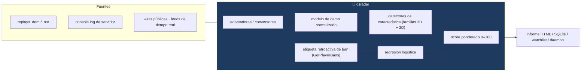
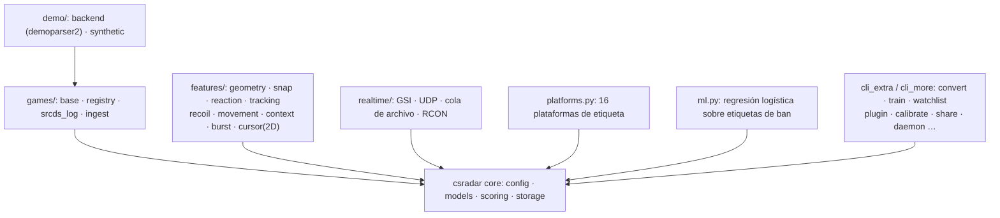
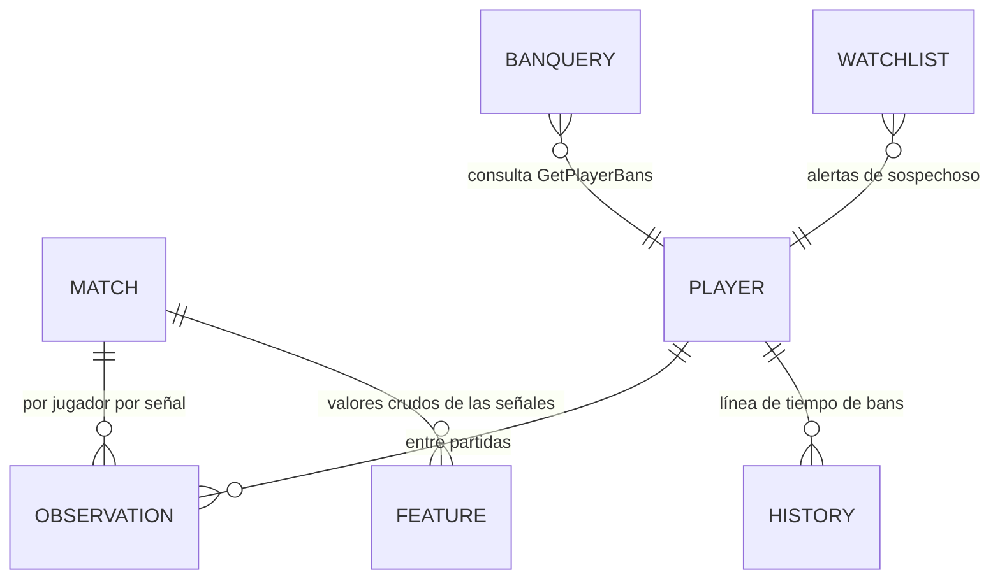
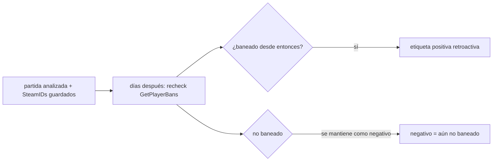
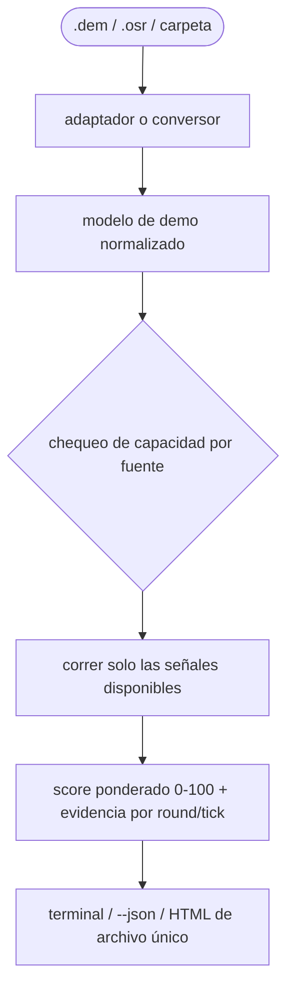
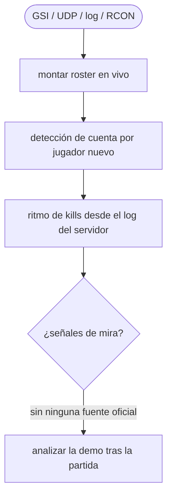
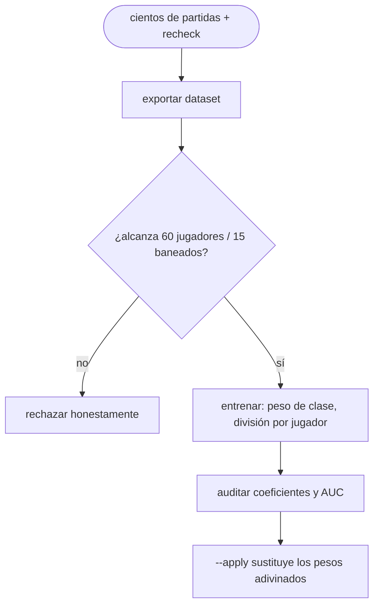
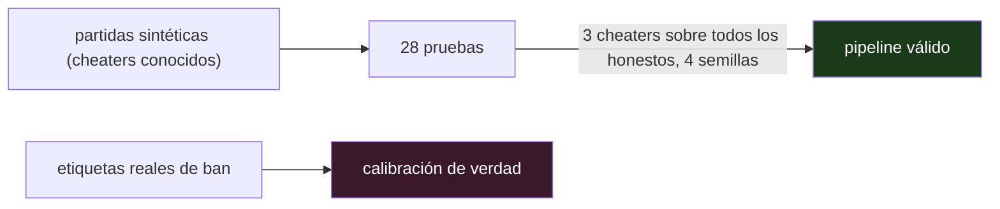

<div align="center">

**🌐 Choose Language / Selecione o Idioma / Elija el Idioma**

[](README.md)&nbsp;&nbsp;&nbsp;[](README_PT.md)&nbsp;&nbsp;&nbsp;[](README_ES.md)

</div>

---

<div align="center">

```
 ██████╗███████╗██████╗  █████╗ ██████╗  █████╗ ██████╗
██╔════╝██╔════╝██╔══██╗██╔══██╗██╔══██╗██╔══██╗██╔══██╗
██║     ███████╗██████╔╝███████║██████╔╝███████║██████╔╝
██║     ╚════██║██╔══██╗██╔══██║██╔══██╗██╔══██║██╔══██╗
╚██████╗███████║██║  ██║██║  ██║██║  ██║██║  ██║██║  ██║
 ╚═════╝╚══════╝╚═╝  ╚═╝╚═╝  ╚═╝╚═╝  ╚═╝╚═╝  ╚═╝╚═╝  ╚═╝
   Detección de sospechosos de cheat a partir de replays, logs de servidor y APIs públicas — sin tocar ningún juego
```

---

[]()
[]()
[]()
[]()
[]()
[]()

<br/>

> **Detección de sospechosos de cheat — aliados y enemigos — a partir de replays, logs de servidor
> y APIs públicas. Multijuego, sin tocar el proceso de ningún juego.**
> El análisis de mira es **post-partida**, sobre el replay. El módulo de tiempo real existe y usa
> solo lo que los juegos publican a propósito. Este programa no sortea anticheat, y eso no es una
> configuración que se pueda activar.

<br/>


-8B5CF6?style=flat-square)


</div>

---

## 📑 Índice

<details>
<summary>▶️ <strong>Haz clic para expandir / contraer esta sección</strong></summary>

<table>
<tr>
<td valign="top" width="50%">

**🏗️ Sistema**
- [Visión General](#-visión-general)
- [Arquitectura del Sistema](#-arquitectura-del-sistema)
- [Stack Tecnológica](#-stack-tecnológica)
- [Patrones de Diseño](#-patrones-de-diseño-aplicados)
- [Estructura del Proyecto](#-estructura-del-proyecto)
- [Módulos del Sistema](#-módulos-del-sistema)

**🎮 Cobertura**
- [Cobertura por Juego](#-cobertura-por-juego--escaneo-de-launchers)
- [Scanners de Launcher (23)](#-scanners-de-launcher-23)
- [Juego Fuera de la Lista](#-juego-fuera-de-la-lista)

**🕒 Tiempo Real**
- [Fuentes de Tiempo Real](#-fuentes-de-tiempo-real--cuatro-feeds-oficiales)

</td>
<td valign="top" width="50%">

**🧭 Detección**
- [Las Señales — Detectores de Mira & Comportamiento](#-las-señales--detectores-de-mira--comportamiento)
- [osu! — Segundo Adaptador Nativo](#-osu--segundo-adaptador-nativo)
- [Conversores — Trayendo Otros Juegos](#-conversores--trayendo-otros-juegos)
- [Plataformas de Etiqueta (16)](#-plataformas-de-etiqueta-16)

**🧠 Aprendizaje**
- [Aprendiendo los Pesos](#-aprendiendo-los-pesos)
- [Calibración con tu Propia Base](#-calibración-con-tu-propia-base)
- [Reincidencia & Grupos](#-reincidencia--grupos)
- [Intercambiando Etiquetas con Otras Personas](#-intercambiando-etiquetas-con-otras-personas)
- [Plugins — Detectores Propios](#-plugins--detectores-propios)
- [Automatización](#-automatización)

**💼 Negocio**
- [Reglas de Negocio & Semántica](#-reglas-de-negocio--semántica)
- [Requisitos Funcionales](#-requisitos-funcionales)
- [Requisitos No Funcionales](#-requisitos-no-funcionales)

**📐 Diseño**
- [Modelo de Datos](#-modelo-de-datos)
- [Flujos del Sistema](#-flujos-del-sistema)

**🔐 Seguridad & Operación**
- [Seguridad & Privacidad](#-seguridad--privacidad)
- [Instalación & Ejecución](#-instalación--ejecución)
- [Pruebas Automatizadas](#-pruebas-automatizadas)
- [Métricas & Monitoreo](#-métricas--monitoreo)
- [Limitaciones Conocidas](#-limitaciones-conocidas)

</td>
</tr>
</table>

---

</details>

## 🌟 Visión General

<details>
<summary>▶️ <strong>Haz clic para expandir / contraer esta sección</strong></summary>

**cs-cheat-radar** hace la detección de sospechosos de cheat — aliados y enemigos — a partir de **replays, logs de servidor y APIs públicas**, multijuego, sin tocar el proceso de ningún juego.

> [!WARNING]
> ## Lo que este programa NO hace
> No sortea anticheat, y eso no es una configuración que se pueda activar.
> Para saber dónde están los otros jugadores y hacia dónde apuntan **durante** la partida, solo hay
> un lugar del que sacar el dato: la memoria del cliente. Un programa que lee ahí es un wallhack —
> las mismas llamadas, el mismo hooking, la misma evasión — sin importar qué haga con la información
> después. VAC, EAC y Vanguard no distinguen intención, y quien recibe el ban eres tú.
> Por eso el análisis de mira es **post-partida**, sobre el replay. El módulo de tiempo real existe
> (ver abajo) y usa solo lo que los juegos publican a propósito.

### 🎯 Objetivos del Sistema

| Objetivo | Descripción |
|----------|-------------|
| 🎯 **Análisis de mira post-partida** | Ángulos de visión solo desde replays — nunca desde la memoria del juego |
| 🎮 **Multijuego** | 541 juegos catalogados en cuatro niveles de cobertura |
| 🧮 **Score 0–100 explicable** | Cada señal ponderada, cada hallazgo reportado por round y tick |
| 🧠 **Aprende, con honestidad** | Los pesos entrenan con etiquetas reales de ban; rechazo por debajo de los mínimos estadísticos |
| 🔒 **Privado por diseño** | Informes HTML de archivo único, intercambio pseudoanonimizado, cero llamadas remotas |
| 🧪 **Siempre verificado** | 28 pruebas en partidas sintéticas con cheaters conocidos |

### ⚖️ Límite Legal y Ético

Esto sirve para decidir **qué ver** y qué reportar por los canales **oficiales de Valve**. No lo uses para acusar públicamente a nadie basándote en un número. La salida es **cola de priorización, nunca veredicto**.

---

</details>

## 🏗️ Arquitectura del Sistema

<details>
<summary>▶️ <strong>Haz clic para expandir / contraer esta sección</strong></summary>

### Flujo de Datos



### Mapa de Módulos por Capacidad



La pieza central es el **modelo de demo normalizado** en `models.py`: todo juego y formato cae en el mismo esquema, independiente del parser que lo alimentó — lo que deja que un solo pipeline de detectores atienda todos los juegos.

---

</details>

## 🛠️ Stack Tecnológica

<details>
<summary>▶️ <strong>Haz clic para expandir / contraer esta sección</strong></summary>

| Capa | Tecnología | Propósito |
|------|-----------|-----------|
| 🧠 **Lenguaje** | Python 3.10+ (probado en 3.14) | Todo |
| 📦 **Instalación base** | Pura stdlib | `pip install -e .` — el modo sintético funciona sin extras |
| 🎮 **Parsing de demo** | demoparser2 0.42 (polars) | Leer `.dem` de verdad; el adaptador acepta polars y pandas |
| 🗄️ **Almacenamiento** | SQLite | Sin servidor, sin infraestructura |
| 📄 **Informes** | HTML de archivo único autocontenido | Sin CDN, sin fuente remota; abre dentro de un año y no filtra nada |
| 🧠 **ML** | Regresión logística en Python puro | Auditable de una sentada; rechaza por debajo del mínimo de muestra |
| 🏗️ **Replay de osu!** | LZMA "alone" de la stdlib | Lector/escritor nativo de `.osr` con **cero dependencias** |
| 🔌 **Red** | `urllib` para la Steam API | Sin dependencia de `requests` |
| 🎲 **Datos sintéticos** | `demo/synthetic.py` | Partidas con cheaters conocidos, para pruebas y selftest |

---

</details>

## 📐 Patrones de Diseño Aplicados

<details>
<summary>▶️ <strong>Haz clic para expandir / contraer esta sección</strong></summary>

| Patrón | Dónde | Justificación |
|--------|-------|---------------|
| 🤝 **Modelo de capacidades** | Cada fuente declara lo que sus datos sostienen (`games/base.py`) | Ninguna fuente promete más de lo que sus datos entregan — fijado por dos pruebas |
| 🔌 **Backend adaptador** | `demo/backend.py` normaliza demoparser2 → modelo interno | Los parsers se pueden cambiar; los detectores nunca conocen el formato |
| 🧩 **Contrato de plugin** | `REQUIRES` / `PRODUCES` / `analyze(...)` | Los detectores del usuario comparten el contrato interno; un plugin maduro se vuelve núcleo sin reescribirlo |
| 🛡️ **Rechazo honesto** | Chequeos tipo lattice: muestra insuficiente, dato faltante, clase rara | Un cómputo rechazado se reporta como tal, nunca como número |
| 📤 **Intercambio pseudoanonimizado** | SteamID → HMAC con sal aleatoria | Intercambiar señales crudas sin intercambiar identidad |
| 🏗️ **Detectores limitados por capacidad** | Sin `pitch`/`yaw` → las señales de mira saltan en silencio y el informe avisa en la primera línea | El dato faltante nunca produce una condena errónea |

---

</details>

## 📁 Estructura del Proyecto

<details>
<summary>▶️ <strong>Haz clic para expandir / contraer esta sección</strong></summary>

```
cs-cheat-radar/
│
├── 📂 csradar/
│   ├── config.py        parámetros de detección (JSON en ~/.csradar/config.json)
│   ├── models.py        modelo normalizado de demo, independiente de parser
│   ├── scoring.py       combina señales en score 0-100
│   ├── report.py        salida para la terminal
│   ├── storage.py       SQLite: partidas, observaciones, consultas de ban
│   ├── steam.py         Web API, conversión de SteamID, perfil de riesgo
│   ├── live.py          tail del console.log + parse de `status`
│   ├── labeling.py      etiqueta retroactiva y precisión/recall
│   ├── cli.py           interfaz de línea de comandos
│   ├── cli_games.py     comandos games / scan / ingest / realtime
│   ├── catalog.py       23 scanners de launcher (VDF texto y binario, registro)
│   ├── ml.py            regresión logística sobre las etiquetas de ban
│   ├── htmlreport.py    informe en archivo único
│   ├── watchlist.py     reincidencia y vigilancia de carpeta
│   ├── platforms.py     16 plataformas de etiqueta (6 sin clave)
│   ├── cli_extra.py     convert / train / watchlist / daemon / platform / doctor
│   ├── cli_more.py      calibrate / history / explain / rings / recurring /
│   │                    share / plugins / selftest / prune
│   ├── analytics.py     calibración por percentil, reincidencia, grupos, prune
│   ├── sharing.py       intercambio de dataset pseudoanonimizado entre usuarios
│   ├── plugins.py       detectores del usuario, cargados desde una carpeta
│   │
│   ├── 📂 games/
│   │   ├── base.py          capacidades: qué puede entregar cada fuente
│   │   ├── registry.py      catálogo de juegos y nivel de soporte
│   │   ├── srcds_log.py     log de servidor dedicado Source
│   │   ├── ingest.py        formato normalizado JSON/JSONL/CSV
│   │   ├── converters.py    PUBG, r6-dissect y mapeador genérico
│   │   └── osu_replay.py    lector y escritor de .osr (nativo, stdlib)
│   │
│   ├── 📂 realtime/
│   │   ├── sources.py       GSI, UDP de log, cola de archivo, RCON
│   │   └── engine.py        roster en vivo, alertas, snapshot
│   │
│   ├── 📂 demo/
│   │   ├── backend.py       adaptador demoparser2 → modelo normalizado
│   │   └── synthetic.py     generador de partidas con cheaters conocidos
│   │
│   └── 📂 features/
│       ├── geometry.py      ángulos en la convención de Source (pitch positivo = abajo)
│       ├── snap.py          snap angular y jitter residual
│       ├── reaction.py      tiempo de reacción
│       ├── tracking.py      proxy de wallhack y pre-aim
│       ├── recoil.py        control de retroceso en ráfaga
│       ├── movement.py      silent aim y entrada no humana
│       ├── context.py       kills a través de humo/pared
│       ├── burst.py         ritmo de kills (fuentes solo-de-eventos)
│       └── cursor.py        familia 2D: tremor, salto de cursor, tecla
│
├── 📂 tests/test_csradar.py  # 28 pruebas, sin red y sin demoparser2
├── 📄 MANUTENCAO.md          # lo deliberadamente NO construido, reglas de seguridad
├── 📄 README.md              # 🇺🇸 Inglés (principal)
├── 📄 README_PT.md           # 🇧🇷 Portugués
└── 📄 README_ES.md           # 🇪🇸 Español
```

Ver también [MANUTENCAO.md](MANUTENCAO.md): lo que deliberadamente no se construyó, dónde es seguro tocar, y las reglas que no deben aflojarse.

---

</details>

## 📦 Módulos del Sistema

<details>
<summary>▶️ <strong>Haz clic para expandir / contraer esta sección</strong></summary>

| Módulo | Responsabilidad |
|--------|-----------------|
| Núcleo `csradar/` | Config, modelo normalizado, score (0–100), salida de terminal, almacenamiento SQLite |
| `steam.py` | Steam Web API, conversión de SteamID, perfil de riesgo de cuenta |
| `live.py` | Tail del `console.log` + parse de `status` |
| `labeling.py` | Etiqueta retroactiva de bans futuros; precisión/recall contra ellos |
| `catalog.py` | 23 scanners de launcher — VDF texto/binario, registro, JSON, SQLite |
| `games/` | Registro de soporte (541 juegos), capacidades de fuente, log srcds, ingestión |
| `realtime/` | GSI, UDP de log, cola de archivo, RCON — roster en vivo, alertas, snapshot |
| `demo/` | Adaptador demoparser2 + el generador de partidas sintéticas |
| `features/` | Detectores 3D de mira (snap, jitter, reaction, tracking, prefire, recoil, movement, context, burst) y la familia 2D (tremor, cursor_jump, key_timing) |
| `ml.py` | Regresión logística sobre etiquetas de ban, con peso de clase y división por jugador |
| `htmlreport.py` | Informe HTML de archivo único, hits de watchlist, sin recursos remotos |
| `watchlist.py` | Reincidencia, vigilancia de carpeta, daemon |
| `platforms.py` | 16 plataformas de etiqueta, 6 sin ninguna clave |
| `sharing.py` | Exportación/importación pseudoanonimizada de datasets (HMAC + sal) |
| `plugins.py` | Detectores del usuario cargados explícitamente desde una carpeta |
| `analytics.py` | Calibración por percentil, reincidencia, anillos, prune |
| Capas CLI | `cli.py` + `cli_games.py` + `cli_extra.py` + `cli_more.py` |
| Pruebas | `tests/test_csradar.py` — 28 pruebas, sin red, sin demoparser2 |

---

</details>

## 🎮 Cobertura por Juego & Escaneo de Launchers

<details>
<summary>▶️ <strong>Haz clic para expandir / contraer esta sección</strong></summary>

**541 juegos catalogados.** `csradar games` clasifica cada uno en cuatro niveles, y el nivel determina qué señales corren:

| nivel | qué existe | señales disponibles |
|---|---|---|
| **completo** | replay con ángulo de visión por tick | todas |
| **posicional** | posiciones por tick, sin mira | parciales |
| **eventos** | solo kills y rounds | ritmo de kills (débil) |
| **cuenta** | ningún replay legible | solo riesgo de cuenta y ban retroactivo |

Distribución actual: **51 completo, 11 posicional, 167 eventos, 312 cuenta.**

CS2 y osu! son los únicos con adaptador **nativo**. Todo el resto de nivel completo llega por conversor externo + `csradar ingest`, y son muchos: la familia GoldSrc entera (CS 1.6, CS:S, Condition Zero, TFC, DoD, HLDM, Ricochet, Deathmatch Classic), la familia id tech (Quake 1/2/3/4, QuakeWorld, DOOM, OpenArena, Xonotic, Warsow, Urban Terror, RTCW, Wolf:ET, SoF2, Jedi Academy, Call of Duty 2 y 4), los Cube (Sauerbraten, Red Eclipse, AssaultCube), Unreal Tournament 99/2004, Teeworlds/DDNet, TF2 y Rocket League. Esos formatos graban el comando de entrada por cuadro — y el comando incluye el ángulo de visión, que es exactamente lo que los detectores de mira necesitan.

Posicional: Dota, Deadlock, osu!/osu!lazer, Trackmania, World of Tanks/Warships, UT3, CS2D, Beat Saber y el `.replay` local de Fortnite. Eventos: servidor dedicado Source y GoldSrc (con una entrada genérica para cualquier juego de cada motor), Siege, los RTS de Relic y de Blizzard, Rust, Squad, Arma, DayZ, ARK, WoW, PlanetSide, EVE, Killing Floor, Sandstorm, Battlefield 3/4/Hardline vía RCON de servidor comunitario, FiveM/SA-MP/MTA y el grupo de supervivencia con RCON.

VALORANT, Apex, CoD, Overwatch, Tarkov, Roblox y compañía quedan en **cuenta** — no por pereza, sino porque la industria cerró los replays justamente para dificultar el cheat, y el efecto secundario es cerrar también el análisis independiente. Dos pruebas lo fijan: ningún juego con anticheat en kernel puede prometer más que `cuenta`, y ningún juego puede declarar nivel completo/posicional sin nombrar el adaptador o el conversor que entrega el dato.

Si el juego exporta replay o log en cualquier formato, conviértelo y alimenta el formato de ingestión (`csradar games --spec`): JSON, JSONL o CSV. Lo que proporciones determina qué corre — sin `pitch`/`yaw` por tick las señales de mira simplemente no se ejecutan, y el informe dice en la primera línea lo que quedó fuera. Un score bajo en una fuente pobre no significa jugador limpio, y el programa lo repite en la salida para que no te engañes.

---

</details>

## 📋 Scanners de Launcher (23)

<details>
<summary>▶️ <strong>Haz clic para expandir / contraer esta sección</strong></summary>

`csradar scan` enumera los títulos instalados, cada uno con su propio formato:

| plataforma | cómo |
|---|---|
| Steam | `libraryfolders.vdf` + `appmanifest_*.acf` (parser de KeyValues propio) |
| Epic | manifiestos `.item` JSON |
| Legendary/Heroic | `installed.json` (cliente Epic alternativo, Linux) |
| GOG Galaxy | registro + `galaxy-2.0.db` (SQLite, solo lectura) |
| Xbox / Game Pass | `.GamingRoot` en la raíz de los discos + `AppxManifest.xml` |
| Battle.net | `Battle.net.config` (JSON) |
| Riot | `RiotClientInstalls.json` |
| EA / Origin | `LocalContent` + `EA Desktop/InstallData` |
| Ubisoft | registro del Ubisoft Launcher |
| Rockstar | registro de Rockstar Games |
| Amazon Games | `GameInstallInfo.sqlite` |
| itch.io | `butler.db` (SQLite) |
| Lutris | `pga.db` (SQLite, Linux) |
| Heroic | `installed.json` de Epic, GOG y Amazon |
| Meta / Oculus | manifiestos JSON + `Oculus/Software` (catálogo VR) |
| Wargaming | `preferences.xml` del Game Center |
| Minecraft | existencia de `.minecraft` — el launcher no guarda inventario |
| Roblox | `Roblox/Versions` |
| atajos no-Steam | `shortcuts.vdf` (VDF **binario**, parser propio) |
| Flatpak | `/var/lib/flatpak/app` y el del usuario (Linux) |
| Snap | `/snap` (Linux) |
| carpetas conocidas | Riot, Battlestate, HoYoPlay, Nexon, NCSOFT, Garena, NetEase, Oculus, Epic, EA |
| registro Uninstall | red de seguridad para todo lo que tiene desinstalador |

> [!NOTE]
> Steam también se busca en las rutas de Linux y macOS. Un scanner que se rompe (launcher corrupto, base bloqueada, permiso denegado) no tumba el escaneo: el error queda registrado y el resto continúa.

---

</details>

## 📉 Juego Fuera de la Lista

<details>
<summary>▶️ <strong>Haz clic para expandir / contraer esta sección</strong></summary>

> Fusionado en la sección de cobertura — ver [Cobertura por Juego](#-cobertura-por-juego--escaneo-de-launchers) y [Conversores](#-conversores--trayendo-otros-juegos). El formato de ingestión (`csradar games --spec`, `csradar ingest`) acepta JSON, JSONL o CSV; cada conversor declara solo las capacidades que el dato realmente sostiene.

---

</details>

## 🕒 Fuentes de Tiempo Real — Cuatro Feeds Oficiales

<details>
<summary>▶️ <strong>Haz clic para expandir / contraer esta sección</strong></summary>

En vivo, el programa mantiene el roster, dispara la detección de cuenta de cada jugador en cuanto aparece, y ejecuta la señal de ritmo de kills cuando hay log de servidor. **El análisis de mira no corre en vivo** — el ángulo de visión de los otros jugadores no está en ninguna fuente oficial. Al terminar la partida, analiza la demo.

| fuente | qué entrega | exige |
|---|---|---|
| `--udp host:puerto` | eventos completos en vivo | servidor dedicado **tuyo** (`logaddress_add`) |
| `--log archivo` | lo mismo, leyendo el log en disco | acceso al log |
| `--gsi` | marcador, round, roster al observar | `-condebug` no; config del GSI (`--install-gsi`) |
| `--rcon host:puerto:contraseña` | `status` periódico | tu servidor |

> [!IMPORTANT]
> Una limitación honesta del GSI: el bloque `allplayers` solo viene cuando estás mirando/observando. En una partida normal entrega solo a tu propio jugador. No hay contorno oficial, y el no oficial es exactamente lo que este proyecto se niega a hacer.

---

</details>

## 🧭 Las Señales — Detectores de Mira & Comportamiento

<details>
<summary>▶️ <strong>Haz clic para expandir / contraer esta sección</strong></summary>

| señal | qué mide | por qué es específica |
|---|---|---|
| `snap` | la mira sale de >12° y llega a <2,5° en pocos ticks | exige también **ausencia de overshoot** y **estabilidad después de trabar**. Un flick humano rápido cruza esa distancia en un tick a 64 Hz, así que la transición sola no distingue nada |
| `jitter` | desviación estándar del error angular después de trabar | el humano oscila; la corrección por software queda plana |
| `reaction` | tiempo entre que el objetivo aparece y el primer disparo | solo se mide cuando el jugador estaba **sosteniendo un ángulo**. Si él mismo giró hasta el objetivo, la "entrada al FOV" es obra suya y el tiempo no significa nada |
| `tracking` | la mira sigue a un enemigo lejano sin disparar | exige que el **ángulo hacia el objetivo haya cambiado** durante el episodio. Sin eso contaríamos crosshair placement, que es lo que un buen jugador hace a propósito |
| `prefire` | la mira ya pegada al objetivo 0,5 s y 1 s antes de la kill | no depende de "entrada al FOV", que nunca pasa para quien ve al enemigo todo el tiempo |
| `recoil` | error medio **y** dispersión bajos a lo largo de una ráfaga | compensar bien es habilidad entrenable, así que "compensó bien" no es señal. Lo que delata es la *forma*: el humano corrige en ciclo (erra, tira de más, corrige); el software resta un vector y el error queda plano |
| `movement` | la mira salta y **regresa** al ángulo de origen en 1–2 ticks | el "silent aim". El tamaño del salto casi no importa — lo que delata es la precisión del regreso. Nadie gira 40° y vuelve al mismo ángulo con medio grado de error |
| `context` | kills a través de humo, pared, sin mirar | cada tasa aislada tiene explicación inocente; la señal solo crece cuando dos categorías suben juntas. Necesita las flags por kill, que hoy solo entrega CS2 |
| `tremor` | ausencia del micro-temblor de la mano en la trayectoria del cursor (2D) | la mano humana nunca dibuja una curva limpia; la interpolación de aim assist, sí. Mide el jerk normalizado por la velocidad, y solo donde hay movimiento |
| `cursor_jump` | salto de cursor seguido de parada (2D) | la mano no se teletransporta; el software que reposiciona el cursor, sí |
| `key_timing` | dispersión de la duración de los clics cerca de cero (2D) | relax presiona con regularidad de máquina incluso cuando la media parece plausible |
| `burst` | multikill demasiado comprimido e intervalos demasiado regulares | **débil.** Es la única que sobrevive sin ángulo de visión. Un ace de AWP legítimo produce el mismo patrón, y el log de servidor tiene resolución de 1 segundo. Cuando es la única señal disponible, el score se limita a 60 |

**HS% y K/D no entran al score.** Apuntan a gente buena, no a cheaters. El score final es el promedio ponderado de las señales, con peso reducido para señales sin muestra suficiente y un bono pequeño cuando dos señales independientes son fuertes a la vez.

---

</details>

## 🎵 osu! — Segundo Adaptador Nativo

<details>
<summary>▶️ <strong>Haz clic para expandir / contraer esta sección</strong></summary>

El `.osr` es formato público y usa LZMA "alone", que viene en la stdlib — así que este adaptador **no tiene dependencia alguna**. Lee la posición del cursor a ~60 Hz y el estado de las teclas cuadro a cuadro: el dato de entrada más crudo que cualquier juego distribuye públicamente.

```bash
csradar analyze replay.osr
```

Como no hay enemigo ni ángulo de visión, corre una familia propia de detectores 2D (`tremor`, `cursor_jump`, `key_timing`) y los 3D quedan fuera — el mismo mecanismo de capacidad de siempre. Nada aquí mira la precisión de notas: sin el beatmap no hay forma de saber qué era lo correcto, y adivinarlo produciría una acusación basada en nada.

---

</details>

## 🔁 Conversores — Trayendo Otros Juegos

<details>
<summary>▶️ <strong>Haz clic para expandir / contraer esta sección</strong></summary>

Escribir un parser binario por juego no escala, y para la mayoría ni siquiera hay replay legible. Lo que escala es convertir la salida de las herramientas que ya existen:

```bash
csradar convert --from pubg telemetria.json --analyze
csradar convert --from r6 partida.json --analyze
csradar convert --from map dados.json --spec meu_mapa.json --analyze
csradar convert --example-spec      # esqueleto del mapeo
```

El modo `map` es el importante: un archivo de reglas de diez líneas conecta **cualquier** JSON al formato interno, sin código nuevo. La sintaxis de ruta tiene `a.b.c`, `a[]` para iterar listas y `$parent.campo` para alcanzar el objeto de arriba — porque el número del frame casi siempre está un nivel por encima del jugador.

Cada conversor declara solo las capacidades que el dato realmente sostiene. La telemetría de PUBG, por ejemplo, cubre a todos los jugadores de la partida pero **no trae dirección de mira**, y `LogPlayerPosition` se muestrea cada ~10 segundos — así que entra como `eventos`, y los detectores de mira no corren.

---

</details>

## 🌐 Plataformas de Etiqueta (16)

<details>
<summary>▶️ <strong>Haz clic para expandir / contraer esta sección</strong></summary>

**16 plataformas, seis de ellas sin ninguna clave:**

| plataforma | qué entrega | clave |
|---|---|---|
| FACEIT | bans propios de CS, elo, edad de la cuenta | sí |
| Battlemetrics | bans agregados de servidores comunitarios | sí |
| PUBG | telemetría pública de la partida (se vuelve ingestión) | sí |
| Steam Community | `vacBanned` del perfil XML — VAC **sin clave de Steam** | **no** |
| OpenDota | perfil y partidas de Dota 2 | **no** |
| gametools | estadísticas de Battlefield (headshot %) | **no** |
| Lichess | `tosViolation`: etiqueta explícita de trampa | **no** |
| Chess.com | cuenta cerrada por *fair play* | **no** |
| Riot | resuelve Riot ID en PUUID (Riot no publica bans) | sí |
| Bungie | perfiles de Destiny 2 vinculados | sí |
| Wargaming | cuenta de WoT/WoWs (desaparición = señal débil) | sí |
| ballchasing | replays públicos de Rocket League | sí |
| osu! | perfil; la cuenta restringida desaparece de la API | sí |
| OpenXBL | gamertag, gamerscore, catálogo de Xbox | sí |
| Tracker Network | perfil y estadísticas de CS2/VALORANT/etc. | sí |
| RuneScape | hiscores OSRS/RS3: presencia y nivel de la cuenta | **no** |

FACEIT banea por cuenta propia y suele ser más rápida que el VAC; Battlemetrics agrega bans de servidores comunitarios, que es el único castigo real en varios juegos de supervivencia. Lichess y Chess.com son las únicas que publican la etiqueta de trampa directa, sin clave — el `recheck` del VAC, gratis. Y el perfil XML de Steam da `vacBanned` sin clave alguna, lo que saca del cero a quien todavía no pidió clave de API. Todas son etiqueta independiente del VAC.

`csradar risk --cross` fusiona las que aceptan SteamID en un solo perfil. El riesgo externo **no se suma** al local: se queda el mayor de los dos, y cada motivo aparece con la fuente entre corchetes. Sumar convertiría dos sospechas débiles en una certeza falsa.

---

</details>

## 🧠 Aprendiendo los Pesos

<details>
<summary>▶️ <strong>Haz clic para expandir / contraer esta sección</strong></summary>

Los pesos por defecto son una suposición informada. Después de unos cientos de partidas con `recheck` corriendo, se puede medir:

```bash
csradar train              # muestra coeficientes y métricas
csradar train --apply      # sustituye los pesos adivinados por los aprendidos
```

Regresión logística en Python puro, auditable de una sentada. Lo que está codificado en ella:

- **peso de clase** — sin esto el gradiente ignora a los positivos;
- **división por jugador**, nunca por observación — el mismo jugador aparece en varias partidas, y dividir por observación haría que el modelo memorizara personas en vez de aprender comportamiento;
- **rechazo explícito** por debajo de 60 jugadores y 15 baneados — por debajo de eso, el número de precisión que mostrara sería mentira;
- métricas por jugador, con AUC, y el aviso de que negativo es "aún no baneado".

---

</details>

## 📊 Calibración con tu Propia Base

<details>
<summary>▶️ <strong>Haz clic para expandir / contraer esta sección</strong></summary>

Los umbrales por defecto son suposición del autor. **Tus datos son la referencia honesta:**

```bash
csradar calibrate            # percentiles de cada señal en TU base
csradar calibrate --apply    # adopta el umbral derivado del percentil 99
```

Si una señal tiene mediana alta en tu base, no está detectando trampa — está detectando tu juego, tu tickrate o un sesgo del detector. El comando avisa cuando pasa eso.

---

</details>

## 🔁 Reincidencia y Grupos

<details>
<summary>▶️ <strong>Haz clic para expandir / contraer esta sección</strong></summary>

```bash
csradar recurring            # quién puntúa alto de forma consistente
csradar history STEAMID      # trayectoria de un jugador entre partidas
csradar explain STEAMID      # razonamiento completo en una partida
csradar rings                # jugadores que aparecen siempre juntos
```

Un score alto en una partida es ruido; el mismo jugador alto en cinco partidas es otra cosa. `recurring` trae una columna de **consistencia**: cerca de 1 significa puntuar alto siempre, cerca de 0 significa que un pico aislado jaló el promedio.

`rings` no prueba nada por sí solo — los amigos juegan juntos. Lo que importa es un grupo fijo en el que varios puntúan alto.

---

</details>

## 🤝 Intercambiando Etiquetas con Otras Personas

<details>
<summary>▶️ <strong>Haz clic para expandir / contraer esta sección</strong></summary>

Este es el verdadero cuello de botella de trabajar solo: el cheater es una clase rara, y llegar a los 15 baneados que exige el entrenamiento lleva cientos de partidas y meses de espera. Dos o tres personas intercambiando características llegan mucho antes.

```bash
csradar share --export dataset.json
csradar share --inspect recebido1.json recebido2.json
csradar share --train-with recebido1.json recebido2.json
```

El archivo exportado **no contiene** SteamID, nombre, mapa ni nombre de demo — solo los valores de las señales y la etiqueta. El SteamID se vuelve HMAC con sal aleatoria; sin sal, el hash no protegería nada, porque el espacio de SteamID es lo bastante pequeño como para ser barrido por fuerza bruta.

---

</details>

## 🧩 Plugins — Detectores Propios, sin Tocar el Núcleo

<details>
<summary>▶️ <strong>Haz clic para expandir / contraer esta sección</strong></summary>

```bash
csradar plugins --init                    # crea la carpeta y un ejemplo
csradar analyze demo.dem --plugins
```

Un plugin es un `.py` con `REQUIRES`, `PRODUCES` y `analyze(...)` — el mismo contrato que los detectores internos, así que un plugin que madura se puede mover al núcleo sin reescribirlo. Pasa por la misma comprobación de capacidad, y un plugin que se rompe no tumba el análisis: el error se vuelve una señal propia y el resto continúa.

Cargar un plugin ejecuta el archivo — inevitable en Python. Por eso la carga es explícita (`--plugins`), nunca automática.

---

</details>

## ⚙️ Automatización

<details>
<summary>▶️ <strong>Haz clic para expandir / contraer esta sección</strong></summary>

```bash
csradar selftest             # separación honesto/cheater en ~30 s
csradar daemon ~/replays --auto-watch --html ./relatorios
csradar watchlist --add STEAM_1:0:12345 --reason "3 partidas sospechosas"
csradar watchlist
csradar analyze demo.dem --html relatorio.html --watch-hits
csradar doctor
csradar prune --keep 500 --confirm
```

`selftest` existe para el mantenedor: después de tocar un detector, en treinta segundos responde si el cambio mejoró o estropeó las cosas, sin necesidad de leer la salida de pruebas unitarias.

`prune` nunca descarta historial de ban ni a quien está en la watchlist — es exactamente ese historial el que vale más con el tiempo.

El `daemon` vigila la carpeta y analiza lo que aparezca, esperando antes a que el archivo deje de crecer (una demo descargándose tiene un tamaño distinto del final). La `watchlist` avisa cuando un sospechoso reaparece — así es como alguien se convierte en caso: no por una partida, sino por reincidencia.

El informe HTML es un solo archivo, sin CDN y sin fuente remota: abre dentro de un año y no filtra a ningún servidor a quién estás analizando.

---

</details>

## 💼 Reglas de Negocio & Semántica

<details>
<summary>▶️ <strong>Haz clic para expandir / contraer esta sección</strong></summary>

| # | Regla | Detalle |
|---|-------|---------|
| **BR-01** | Nunca tocar la memoria del juego | Leer dónde están/apuntan los jugadores durante la partida es wallhack; el análisis de mira es post-partida, en los replays |
| **BR-02** | Ningún juego puede prometer de más | Los juegos con anticheat en kernel se limitan a `cuenta`; completo/posicional exige un adaptador o conversor nombrado (fijado por dos pruebas) |
| **BR-03** | Sin ángulo de visión ⇒ las señales de mira saltan | Una fuente sin `pitch`/`yaw` por tick nunca produce un hallazgo de mira; el informe dice en la primera línea lo que quedó fuera |
| **BR-04** | Las señales débiles tienen techo | `burst` sola limita el score a 60 — un ace de AWP legítimo produce el mismo patrón |
| **BR-05** | HS% y K/D nunca entran al score | Apuntan a gente buena, no a cheaters |
| **BR-06** | El riesgo externo nunca se suma | `--cross` se queda con el mayor entre local/externo, con las fuentes entre corchetes — sumar fabricaría certeza |
| **BR-07** | La etiqueta negativa significa "aún no baneado" | No "limpio". La precisión importa mucho más que el recall; la exactitud no significa nada |
| **BR-08** | Compartir nunca lleva identidad | SteamID → HMAC con sal aleatoria; sin nombre, mapa ni nombre de demo en el dataset exportado |
| **BR-09** | Los plugins solo cargan explícitamente | Ejecutar un archivo es inevitable en Python; `--plugins` nunca es automático |
| **BR-10** | El entrenamiento rechaza por debajo del mínimo de muestra | Por debajo de 60 jugadores / 15 baneados, los números reportados serían mentira |
| **BR-11** | La salida es cola de priorización | Cada evidencia con round y tick; mira el momento antes de reportar a alguien |

---

</details>

## ✨ Requisitos Funcionales — Inventario de Comandos

<details>
<summary>▶️ <strong>Haz clic para expandir / contraer esta sección</strong></summary>

| Comando | Qué hace |
|---------|----------|
| `csradar games` / `--spec` | Catálogo y nivel de cobertura por juego; esquema de ingestión |
| `csradar scan --supported-only --artifacts` | Enumera títulos instalados en 23 formatos de launcher |
| `csradar demo` | Verifica el pipeline sin necesitar ninguna demo |
| `csradar analyze <ruta> --me <id> [--json] [--html] [--plugins] [--watch-hits]` | Analiza una demo o una carpeta entera |
| `csradar config --steam-key <clave>` | Configura la clave de la Steam API |
| `csradar watch` | Detección de cuenta en vivo (escribe `status` en la consola de CS2) |
| `csradar risk <steamid> [--deep] [--cross]` | Riesgo de cuenta cruzando plataformas |
| `csradar recheck --min-age-days 30` | Etiqueta retroactiva de bans futuros |
| `csradar eval` | Precisión/recall del score contra esos bans |
| `csradar top` / `stats` / `export` | Sospechosos acumulados / estadísticas / exportación de dataset |
| `csradar ingest archivo.jsonl --game rocket_league` | Cualquier juego vía el formato normalizado |
| `csradar realtime [--install-gsi] [--gsi] [--log] [--udp] [--rcon]` | Fuentes oficiales en vivo |
| `csradar convert --from pubg/r6/map --analyze` | Puente entre herramientas externas y el pipeline |
| `csradar train [--apply]` | Aprender pesos de las etiquetas de ban, o aplicarlos |
| `csradar calibrate [--apply]` | Umbrales por percentil en tu base |
| `csradar recurring / history / explain / rings` | Reincidencia y análisis de grupos |
| `csradar share --export/--inspect/--train-with` | Intercambio pseudoanonimizado de datasets |
| `csradar plugins --init` | Scaffolding de detector del usuario |
| `csradar selftest` | Chequeo honesto/cheater en 30 s |
| `csradar daemon --auto-watch --html` | Vigilante de carpeta + informes HTML de archivo único |
| `csradar watchlist --add <id> --reason` | Alertas de reaparición de sospechosos |
| `csradar doctor` / `prune --keep N` | Health check / limpieza segura |
| `csradar platform <nombre> <id>` | Consultar una de las 16 plataformas de etiqueta |

---

</details>

## ⚙️ Requisitos No Funcionales

<details>
<summary>▶️ <strong>Haz clic para expandir / contraer esta sección</strong></summary>

| ID | Categoría | Requisito | Meta |
|----|-----------|-----------|------|
| **RNF-01** | 📦 Cero deps obligatorias | La instalación base corre con pura stdlib | `pip install -e .` solo → modo sintético |
| **RNF-02** | 🏠 Sin infraestructura | Sin servidor, sin nube | SQLite + informe HTML de archivo único |
| **RNF-03** | 🔒 Privacidad offline | Informes y análisis no filtran nada | Sin CDN, sin fuentes remotas, sin tracking |
| **RNF-04** | ⏱️ Feedback rápido del mantenedor | Cambio de detector validado rápido | `selftest` en ~30 s |
| **RNF-05** | 📉 Estadística honesta | Nunca reportar números bajo el mínimo estadístico | Rechazar < 60 jugadores / < 15 baneados |
| **RNF-06** | 🔁 Determinismo en la división ML | Nunca dividir por observación | Dividir por jugador; el modelo aprende comportamiento, no personas |
| **RNF-07** | 📈 Auditabilidad | Todo el camino de score/ML legible | Regresión logística en Python puro, promedios ponderados |
| **RNF-08** | 🧱 Aislamiento de fallos | Un scanner/plugin roto nunca tumba la ejecución | Los errores se vuelven señales registradas; el resto continúa |

---

</details>

## 🗄️ Modelo de Datos

<details>
<summary>▶️ <strong>Haz clic para expandir / contraer esta sección</strong></summary>

### Almacenamiento — SQLite



| Concepto | Detalle |
|----------|---------|
| `storage.py` | SQLite: partidas, observaciones y consultas de ban en caché |
| Modelo de demo normalizado | El esquema intermedio en el que desemboca todo parser, sea cual sea el juego |
| Formato de intercambio | Señales + etiqueta nada más — SteamID como HMAC(sal), sin nombre/mapa/demo |
| Config | JSON en `~/.csradar/config.json` |

### Flujo de la Etiqueta Retroactiva



---

</details>

## 🔄 Flujos del Sistema

<details>
<summary>▶️ <strong>Haz clic para expandir / contraer esta sección</strong></summary>

### Flujo de Análisis



### Flujo de Vigilancia en Tiempo Real



### Flujo de Aprendizaje



---

</details>

## 🔐 Seguridad & Privacidad

<details>
<summary>▶️ <strong>Haz clic para expandir / contraer esta sección</strong></summary>

> [!IMPORTANT]
> El punto del proyecto es la línea que se niega a cruzar: sin lectura de memoria del juego, sin anticheat sorteado, sin contorno no oficial en tiempo real para ángulos de visión. Todo lo de abajo lo fijan las pruebas de capacidad.

| Control | Implementación | Efecto |
|---------|---------------|--------|
| 🛡️ **Nunca sortea anticheat** | Análisis post-partida desde replays; en vivo usa solo feeds publicados | Sin maquinaria de wallhack, sin riesgo de ban por este programa |
| 🔒 **Los informes no filtran nada** | HTML de archivo único, sin CDN, sin fuente remota | Abre dentro de un año; nadie se entera de a quién analizas |
| 🧂 **Intercambio pseudoanonimizado** | SteamID → HMAC con sal aleatoria por exportación | Intercambio de señales crudas sin identidad; a prueba de fuerza bruta |
| 🧩 **Ejecución explícita de plugins** | Solo con la flag `--plugins` | Cargar un plugin ejecuta un archivo — nunca automático |
| 📉 **Rechazo honesto** | Puertas de capacidad + mínimos estadísticos | Una fuente ausente nunca fabrica un hallazgo |
| 🧱 **Aislamiento de fallos** | Los errores de scanner/plugin se vuelven señales | Un plugin malicioso no tumba el análisis, solo se señala a sí mismo |

### Limitaciones de Seguridad Conocidas

| Limitación | Riesgo | Camino de mitigación |
|------------|--------|----------------------|
| 🧩 **Los plugins son código** | Un plugin no confiable puede hacer todo lo que el usuario puede | Cargar solo plugins que escribiste o auditaste; `--plugins` sigue explícito |
| 🌐 **Fuentes externas en la red** | Claves/consultas de Steam y APIs transitan la máquina del operador | Claves solo en el config local; haz consultas en tu propia cuenta |
| 📊 **Integridad del replay** | Un replay manipulado puede forjar entradas falsas | Analizar demos obtenidas del panel oficial; reportar por round/tick |

---

</details>

## 🚀 Instalación & Ejecución

<details>
<summary>▶️ <strong>Haz clic para expandir / contraer esta sección</strong></summary>

### Instalación

```bash
cd cs-cheat-radar
pip install -e .[all]
```

Si `csradar` no se encuentra después de instalar, el script fue al directorio de scripts del usuario (`%APPDATA%\Python\PythonXXX\Scripts`) y no está en el PATH; usa `python -m csradar ...`, que es equivalente.

Sin argumentos extra solo funciona el modo sintético; `demoparser2` es necesario para leer `.dem` de verdad y `requests` no se usa (la Steam API va por `urllib`, sin dependencia). Probado con Python 3.14 y demoparser2 0.42, que usa polars — el adaptador acepta polars y pandas.

### Cómo conseguir la demo y el console.log

- **Demos**: panel de partidas recientes en CS2, o `csgo_download_match <code>`.
- **console.log**: agrega `-condebug` a las opciones de arranque de CS2. El archivo aparece en `.../Counter-Strike Global Offensive/game/csgo/console.log`. Si está en otro lugar, usa `--log` o la variable `CSRADAR_CONSOLE_LOG`.

Las demos quedan disponibles unos días por el panel de partidas recientes del juego o por `csgo_download_match` en la consola.

### Uso

```bash
# 0. qué se puede hacer en cada juego, y qué tienes instalado
csradar games
csradar scan --supported-only --artifacts

# 1. comprobar que el pipeline funciona, sin necesitar ninguna demo
csradar demo

# 2. analizar una demo (o una carpeta entera de ellas)
csradar analyze "C:\...\csgo\replays\match730_003...dem" --me 7656119...
csradar analyze ./replays --json relatorio.json

# 3. detección de cuentas durante la partida (necesita -condebug en CS2)
csradar config --steam-key TUCLAVE
csradar watch            # escribe `status` en la consola del juego

# 4. riesgo de una cuenta suelta
csradar risk STEAM_1:0:12345 --deep

# 5. etiqueta retroactiva: a quién baneó Valve después
csradar recheck --min-age-days 30
csradar eval             # precisión/recall del score contra esos bans

csradar top              # sospechosos acumulados
csradar stats
csradar export dataset.json

# 6. cualquier otro juego, vía formato normalizado
csradar games --spec
csradar ingest partida.jsonl --game rocket_league

# 7. en vivo, por fuentes oficiales
csradar realtime --install-gsi "...\game\csgo\cfg"
csradar realtime --gsi --log console.log
csradar realtime --udp 0.0.0.0:27500          # servidor dedicado tuyo
```

### Automatización & Aprendizaje (referencia rápida)

```bash
csradar selftest
csradar daemon ~/replays --auto-watch --html ./relatorios
csradar watchlist --add STEAM_1:0:12345 --reason "3 partidas sospechosas"
csradar train [--apply]
csradar calibrate [--apply]
csradar recurring / history / explain / rings
csradar share --export dataset.json
csradar platform faceit STEAM_1:0:12345
csradar plugins --init
csradar doctor
csradar prune --keep 500 --confirm
```

---

</details>

## 🧪 Pruebas Automatizadas

<details>
<summary>▶️ <strong>Haz clic para expandir / contraer esta sección</strong></summary>

```bash
python tests/test_csradar.py     # 28 pruebas, sin red y sin demoparser2
```

El simulador en `csradar/demo/synthetic.py` genera partidas en las que se sabe quién estaba haciendo trampa — algo que una demo real nunca dice. Las pruebas exigen que los **tres** cheaters simulados (aimbot, wallhack, silent aim) queden por encima de todos los honestos en cuatro semillas distintas, que cada uno encienda las señales de su propia categoría, y que una partida totalmente limpia produzca una cola de revisión vacía.

> [!IMPORTANT]
> Esto valida la matemática y el pipeline, **no** la calibración contra la realidad: los perfiles simulados modelan exactamente lo que los detectores buscan. La calibración de verdad solo viene de las etiquetas de ban.

### Mapa de Capas



---

</details>

## 📊 Métricas & Monitoreo

<details>
<summary>▶️ <strong>Haz clic para expandir / contraer esta sección</strong></summary>

| Métrica | Valor |
|---------|-------|
| Juegos catalogados | 541 |
| — completo (ángulo de visión) | 51 |
| — posicional | 11 |
| — eventos | 167 |
| — solo cuenta | 312 |
| Adaptadores nativos | 2 (CS2, osu!) |
| Scanners de launcher | 23 |
| Plataformas de etiqueta consultadas | 16 — **6 sin ninguna clave** |
| Señales en vivo | 12 (10 3D·2D de mira/comportamiento + context + burst) |
| Fuentes de tiempo real | 4 feeds oficiales (GSI, UDP, log, RCON) |
| Pruebas | 28 — sin red, sin demoparser2 |
| Semántica del score | Promedio ponderado 0–100, burst-solo limitado a 60 |
| Análisis de mira en vivo | No — solo post-partida, por diseño |

### Diagnósticos Incorporados

```bash
csradar doctor          # health check
csradar selftest        # ~30 s de regresión honesto/cheater ante cambios de detector
csradar stats           # sospechosos acumulados y cobertura
```

### Mantenimiento (por diseño)

> **Mantenido por una persona + una IA, sin infraestructura dedicada.** Esto decidió el diseño entero: cero dependencia obligatoria, todo stdlib, SQLite en vez de servidor, archivo HTML en vez de dashboard. Lo que deliberadamente *no* se construyó está en [MANUTENCAO.md](MANUTENCAO.md).

---

</details>

## ⚠️ Limitaciones Conocidas

<details>
<summary>▶️ <strong>Haz clic para expandir / contraer esta sección</strong></summary>

### Qué Esperar de Verdad

> [!WARNING]
> - Las demos POV (las tuyas) se parsean peor que las demos de servidor; la tasa de error sube.
> - La resolución de 64 ticks limita la detección de flicks muy rápidos — parte de los cheats bien configurados queda dentro de la distribución humana y simplemente no aparece.
> - Los falsos positivos sobre jugadores legítimamente buenos **van** a pasar, con más frecuencia de la que esperas al principio.

Por eso la salida lista **round y tick** de cada evidencia. Mira el momento en la demo antes de reportar a cualquier persona. La salida es cola de priorización, nunca veredicto.

| Categoría | Límite | Estado |
|-----------|--------|--------|
| 🎯 **Análisis de mira en vivo** | el ángulo de visión de los demás no está en ninguna fuente oficial | ⚠️ Por diseño — analiza la demo post-partida |
| 👁️ **GSI `allplayers`** | solo mientras miras/observas; una partida normal entrega solo a tu jugador | ⚠️ Sin contorno oficial, y el no oficial se rechaza |
| 🎮 **Juegos con anticheat en kernel** | VALORANT, Apex, CoD, Overwatch, Tarkov, Roblox … se limitan a `cuenta` | ⚠️ La industria cerró los replays; dos pruebas fijan el techo |
| ⏱️ **Resolución de 64 ticks** | los flicks extremadamente rápidos pueden esconderse en la distribución humana | ⚠️ Inherente a los datos de replay |
| 📊 **Demos POV** | mayor tasa de error de parse que las demos de servidor | ⚠️ Inherente a la captura POV |
| 🧪 **Calibración sintética** | las pruebas validan matemática/pipeline, no la realidad | ⚠️ La calibración real exige etiquetas de ban |

</details>

---

<div align="center">

---

### 📡 cs-cheat-radar

*Replays, logs de servidor y APIs públicas — sin tocar el proceso de ningún juego.*

[]()
[]()
[]()

<br/>

```
"Cola de priorización, nunca veredicto."
```

</div>