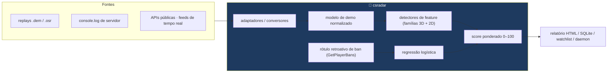
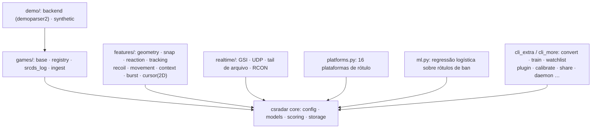
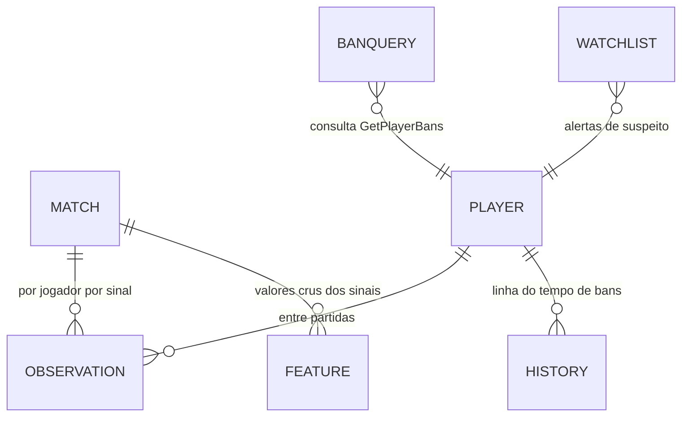
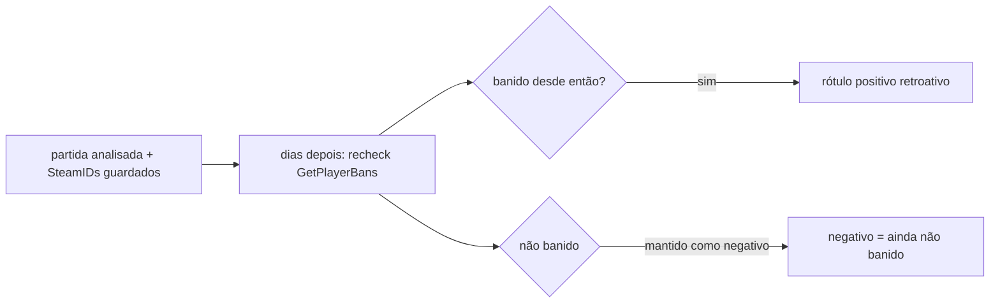
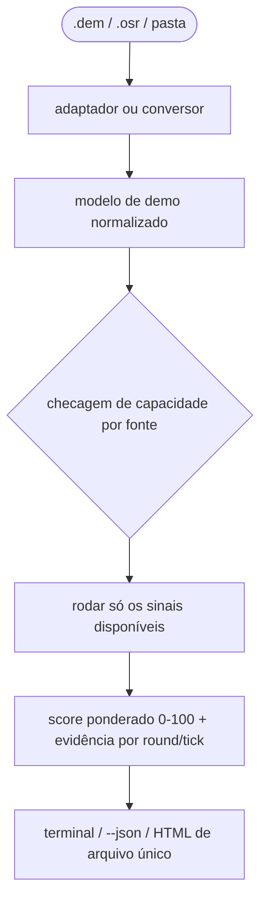
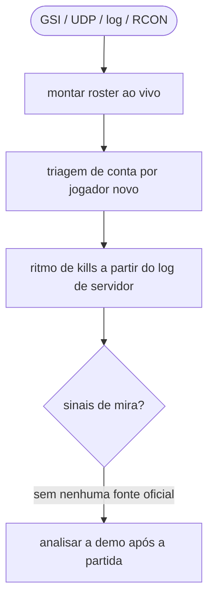
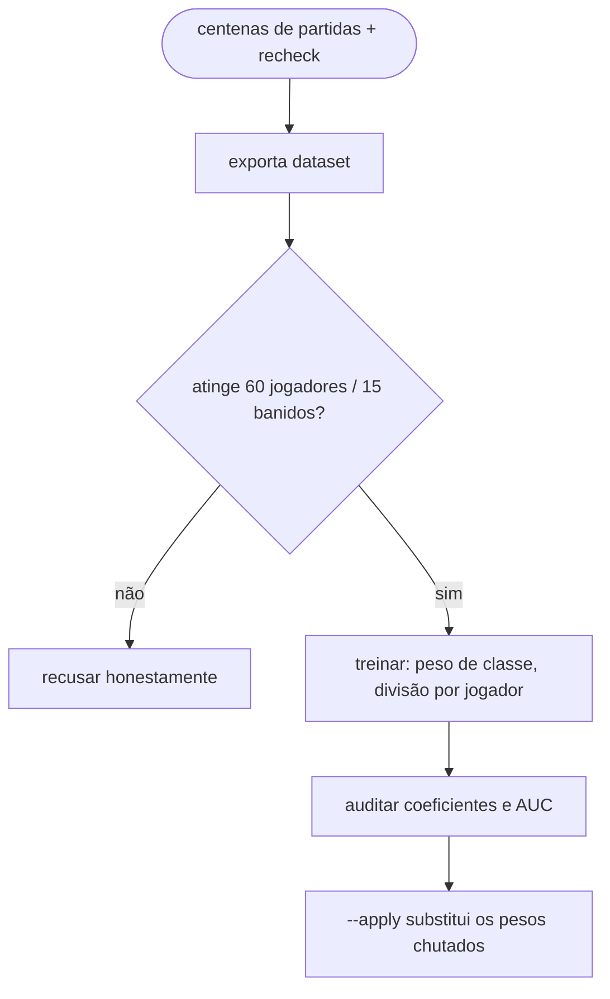
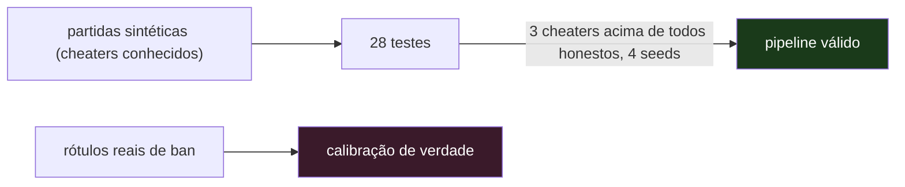

<div align="center">

**🌐 Choose Language / Selecione o Idioma / Elija el Idioma**

[](README.md)&nbsp;&nbsp;&nbsp;[](README_PT.md)&nbsp;&nbsp;&nbsp;[](README_ES.md)

</div>

---

<div align="center">

```
 ██████╗███████╗██████╗  █████╗ ██████╗  █████╗ ██████╗
██╔════╝██╔════╝██╔══██╗██╔══██╗██╔══██╗██╔══██╗██╔══██╗
██║     ███████╗██████╔╝███████║██████╔╝███████║██████╔╝
██║     ╚════██║██╔══██╗██╔══██║██╔══██╗██╔══██║██╔══██╗
╚██████╗███████║██║  ██║██║  ██║██║  ██║██║  ██║██║  ██║
 ╚═════╝╚══════╝╚═╝  ╚═╝╚═╝  ╚═╝╚═╝  ╚═╝╚═╝  ╚═╝╚═╝  ╚═╝
   Triagem de suspeitas de cheat a partir de replays, logs de servidor e APIs públicas — sem tocar em jogo nenhum
```

---

[]()
[]()
[]()
[]()
[]()
[]()

<br/>

> **Triagem de suspeitas de cheat — aliados e inimigos — a partir de replays, logs de servidor
> e APIs públicas. Multi-jogo, sem tocar no processo de jogo nenhum.**
> A análise de mira é **pós-partida**, em cima do replay. O módulo de tempo real existe e usa
> só o que os jogos publicam de propósito. Este programa não contorna anticheat, e isso não é uma
> configuração que dá para ligar.

<br/>


-8B5CF6?style=flat-square)


</div>

---

## 📑 Índice

<details>
<summary>▶️ <strong>Clique para expandir / recolher esta seção</strong></summary>

<table>
<tr>
<td valign="top" width="50%">

**🏗️ Sistema**
- [Visão Geral](#-visão-geral)
- [Arquitetura do Sistema](#-arquitetura-do-sistema)
- [Stack Tecnológica](#-stack-tecnológica)
- [Padrões de Projeto](#-padrões-de-projeto-aplicados)
- [Estrutura do Projeto](#-estrutura-do-projeto)
- [Módulos do Sistema](#-módulos-do-sistema)

**🎮 Cobertura**
- [Cobertura por Jogo](#-cobertura-por-jogo--escaneamento-de-launchers)
- [Scanners de Launcher (23)](#-scanners-de-launcher-23)
- [Jogo Fora da Lista](#-jogo-fora-da-lista)

**🕒 Tempo Real**
- [Fontes de Tempo Real](#-fontes-de-tempo-real--quatro-feeds-oficiais)

</td>
<td valign="top" width="50%">

**🧭 Detecção**
- [Os Sinais — Detectores de Mira & Comportamento](#-os-sinais--detectores-de-mira--comportamento)
- [osu! — Segundo Adaptador Nativo](#-osu--segundo-adaptador-nativo)
- [Conversores — Trazendo Outros Jogos](#-conversores--trazendo-outros-jogos)
- [Plataformas de Rótulo (16)](#-plataformas-de-rótulo-16)

**🧠 Aprendizado**
- [Aprendendo os Pesos](#-aprendendo-os-pesos)
- [Calibração com a Sua Própria Base](#-calibração-com-a-sua-própria-base)
- [Reincidência & Grupos](#-reincidência--grupos)
- [Trocando Rótulo com Outras Pessoas](#-trocando-rótulo-com-outras-pessoas)
- [Plugins — Detectores Seus](#-plugins--detectores-seus)
- [Automação](#-automação)

**💼 Negócio**
- [Regras de Negócio & Semântica](#-regras-de-negócio--semântica)
- [Requisitos Funcionais](#-requisitos-funcionais)
- [Requisitos Não Funcionais](#-requisitos-não-funcionais)

**📐 Design**
- [Modelo de Dados](#-modelo-de-dados)
- [Fluxos do Sistema](#-fluxos-do-sistema)

**🔐 Segurança & Operação**
- [Segurança & Privacidade](#-segurança--privacidade)
- [Instalação & Execução](#-instalação--execução)
- [Testes Automatizados](#-testes-automatizados)
- [Métricas & Monitoramento](#-métricas--monitoramento)
- [Limitações Conhecidas](#-limitações-conhecidas)

</td>
</tr>
</table>

---

</details>

## 🌟 Visão Geral

<details>
<summary>▶️ <strong>Clique para expandir / recolher esta seção</strong></summary>

**cs-cheat-radar** faz a triagem de suspeitas de cheat — aliados e inimigos — a partir de **replays, logs de servidor e APIs públicas**, multi-jogo, sem tocar no processo de jogo nenhum.

> [!WARNING]
> ## O que este programa não faz
> Não contorna anticheat, e isso não é uma configuração que dá para ligar.
> Para saber onde os outros jogadores estão e para onde estão mirando **durante** a partida, só há
> um lugar de onde tirar o dado: a memória do cliente. Um programa que lê de lá é um wallhack — as
> mesmas chamadas, o mesmo hooking, a mesma evasão — independentemente do que ele faça com a
> informação depois. VAC, EAC e Vanguard não distinguem intenção, e quem toma o ban é você.
> Por isso a análise de mira é **pós-partida**, em cima do replay. O módulo de tempo real existe
> (veja abaixo) e usa só o que os jogos publicam de propósito.

### 🎯 Objetivos do Sistema

| Objetivo | Descrição |
|----------|-----------|
| 🎯 **Análise de mira pós-partida** | Ângulos de visão só de replays — nunca da memória do jogo |
| 🎮 **Multi-jogo** | 541 jogos catalogados em quatro níveis de cobertura |
| 🧮 **Score 0–100 explicável** | Cada sinal ponderado, cada achado reportado por round e tick |
| 🧠 **Aprende, com honestidade** | Pesos treinam com rótulos reais de ban; recusa abaixo dos mínimos estatísticos |
| 🔒 **Privado por design** | Relatórios HTML de arquivo único, compartilhamento pseudo-anonimizado, zero chamadas remotas |
| 🧪 **Sempre verificado** | 28 testes em partidas sintéticas com cheaters conhecidos |

### ⚖️ Limite Legal e Ético

Isto serve para decidir **o que assistir** e o que reportar pelos canais **oficiais da Valve**. Não use para acusar publicamente ninguém com base num número. A saída é **fila de priorização, nunca veredito**.

---

</details>

## 🏗️ Arquitetura do Sistema

<details>
<summary>▶️ <strong>Clique para expandir / recolher esta seção</strong></summary>

### Fluxo de Dados



### Mapa de Módulos por Capacidade



A peça central é o **modelo de demo normalizado** em `models.py`: todo jogo e formato cai no mesmo schema, independente do parser que o alimentou — o que deixa um único pipeline de detectores atender todos os jogos.

---

</details>

## 🛠️ Stack Tecnológica

<details>
<summary>▶️ <strong>Clique para expandir / recolher esta seção</strong></summary>

| Camada | Tecnologia | Propósito |
|--------|-----------|-----------|
| 🧠 **Linguagem** | Python 3.10+ (testado na 3.14) | Tudo |
| 📦 **Instalação base** | Pura stdlib | `pip install -e .` — modo sintético funciona sem extras |
| 🎮 **Parsing de demo** | demoparser2 0.42 (polars) | Ler `.dem` de verdade; o adaptador aceita polars e pandas |
| 🗄️ **Armazenamento** | SQLite | Sem servidor, sem infra |
| 📄 **Relatórios** | HTML de arquivo único autocontido | Sem CDN, sem fonte remota, abre daqui a um ano e não vaza nada |
| 🧠 **ML** | Regressão logística em Python puro | Auditável numa sentada; recusa abaixo do mínimo de amostra |
| 🏗️ **Replay de osu!** | LZMA "alone" da stdlib | Leitor/escritor nativo de `.osr` com **zero dependências** |
| 🔌 **Rede** | `urllib` para a Steam API | Sem dependência de `requests` |
| 🎲 **Dados sintéticos** | `demo/synthetic.py` | Partidas com cheaters conhecidos, para testes e selftest |

---

</details>

## 📐 Padrões de Projeto Aplicados

<details>
<summary>▶️ <strong>Clique para expandir / recolher esta seção</strong></summary>

| Padrão | Onde | Justificativa |
|--------|------|---------------|
| 🤝 **Modelo de capacidades** | Cada fonte declara o que seus dados sustentam (`games/base.py`) | Nenhuma fonte promete mais do que seus dados entregam — travado por dois testes |
| 🔌 **Backend adaptador** | `demo/backend.py` normaliza demoparser2 → modelo interno | Parsers podem ser trocados; os detectores nunca conhecem o formato |
| 🧩 **Contrato de plugin** | `REQUIRES` / `PRODUCES` / `analyze(...)` | Detectores do usuário compartilham o contrato interno; um plugin maduro vira núcleo sem reescrita |
| 🛡️ **Recusa honesta** | Checagens do tipo lattice: amostra insuficiente, dado faltante, classe rara | Computação recusada é reportada como tal, nunca como número |
| 📤 **Compartilhamento pseudo-anonimizado** | SteamID → HMAC com sal aleatório | Trocar sinais crus sem nunca trocar identidade |
| 🏗️ **Detectores limitados por capacidade** | Sem `pitch`/`yaw` → os sinais de mira pulam em silêncio e o relatório avisa na primeira linha | Dado faltante nunca produz condenação errada |

---

</details>

## 📁 Estrutura do Projeto

<details>
<summary>▶️ <strong>Clique para expandir / recolher esta seção</strong></summary>

```
cs-cheat-radar/
│
├── 📂 csradar/
│   ├── config.py        parâmetros de detecção (JSON em ~/.csradar/config.json)
│   ├── models.py        modelo normalizado de demo, independente de parser
│   ├── scoring.py       combina sinais em score 0-100
│   ├── report.py        saída para o terminal
│   ├── storage.py       SQLite: partidas, observações, consultas de ban
│   ├── steam.py         Web API, conversão de SteamID, perfil de risco
│   ├── live.py          tail do console.log + parse de `status`
│   ├── labeling.py      rótulo retroativo e precisão/revogação
│   ├── cli.py           interface de linha de comando
│   ├── cli_games.py     comandos games / scan / ingest / realtime
│   ├── catalog.py       23 scanners de launcher (VDF texto e binário, registro)
│   ├── ml.py            regressão logística sobre os rótulos de ban
│   ├── htmlreport.py    relatório em arquivo único
│   ├── watchlist.py     reincidência e vigia de pasta
│   ├── platforms.py     16 plataformas de rótulo (6 sem chave)
│   ├── cli_extra.py     convert / train / watchlist / daemon / platform / doctor
│   ├── cli_more.py      calibrate / history / explain / rings / recurring /
│   │                    share / plugins / selftest / prune
│   ├── analytics.py     calibração por percentil, reincidência, grupos, prune
│   ├── sharing.py       troca de dataset pseudo-anonimizado entre usuários
│   ├── plugins.py       detectores do usuário, carregados de uma pasta
│   │
│   ├── 📂 games/
│   │   ├── base.py          capacidades: o que cada fonte consegue entregar
│   │   ├── registry.py      catálogo de jogos e nível de suporte
│   │   ├── srcds_log.py     log de servidor dedicado Source
│   │   ├── ingest.py        formato normalizado JSON/JSONL/CSV
│   │   ├── converters.py    PUBG, r6-dissect e mapeador genérico
│   │   └── osu_replay.py    leitor e escritor de .osr (nativo, stdlib)
│   │
│   ├── 📂 realtime/
│   │   ├── sources.py       GSI, UDP de log, tail de arquivo, RCON
│   │   └── engine.py        roster ao vivo, alertas, snapshot
│   │
│   ├── 📂 demo/
│   │   ├── backend.py       adaptador demoparser2 → modelo normalizado
│   │   └── synthetic.py     gerador de partidas com cheaters conhecidos
│   │
│   └── 📂 features/
│       ├── geometry.py      ângulos na convenção da Source (pitch positivo = baixo)
│       ├── snap.py          snap angular e jitter residual
│       ├── reaction.py      tempo de reação
│       ├── tracking.py      proxy de wallhack e pre-aim
│       ├── recoil.py        controle de recuo em rajada
│       ├── movement.py      silent aim e entrada não-humana
│       ├── context.py       kills através de fumaça/parede
│       ├── burst.py         ritmo de kills (fontes só-de-eventos)
│       └── cursor.py        família 2D: tremor, salto de cursor, tecla
│
├── 📂 tests/test_csradar.py  # 28 testes, sem rede e sem demoparser2
├── 📄 MANUTENCAO.md          # o que foi deliberadamente não construído, regras de segurança
├── 📄 README.md              # 🇺🇸 Inglês (principal)
├── 📄 README_PT.md           # 🇧🇷 Português
└── 📄 README_ES.md           # 🇪🇸 Espanhol
```

Ver também [MANUTENCAO.md](MANUTENCAO.md): o que foi deliberadamente não construído, onde é seguro mexer, e as regras que não devem ser afrouxadas.

---

</details>

## 📦 Módulos do Sistema

<details>
<summary>▶️ <strong>Clique para expandir / recolher esta seção</strong></summary>

| Módulo | Responsabilidade |
|--------|------------------|
| Núcleo `csradar/` | Config, modelo normalizado, score (0–100), saída no terminal, armazenamento SQLite |
| `steam.py` | Steam Web API, conversão de SteamID, perfil de risco de conta |
| `live.py` | Tail do `console.log` + parse de `status` |
| `labeling.py` | Rótulo retroativo de bans futuros; precisão/revogação contra eles |
| `catalog.py` | 23 scanners de launcher — VDF texto/binário, registro, JSON, SQLite |
| `games/` | Registro de suporte (541 jogos), capacidades de fonte, log srcds, ingestão |
| `realtime/` | GSI, UDP de log, tail de arquivo, RCON — roster ao vivo, alertas, snapshot |
| `demo/` | Adaptador demoparser2 + o gerador de partidas sintéticas |
| `features/` | Detectores 3D de mira (snap, jitter, reaction, tracking, prefire, recoil, movement, context, burst) e a família 2D (tremor, cursor_jump, key_timing) |
| `ml.py` | Regressão logística sobre rótulos de ban, com peso de classe e divisão por jogador |
| `htmlreport.py` | Relatório HTML de arquivo único, hits de watchlist, sem recursos remotos |
| `watchlist.py` | Reincidência, vigia de pasta, daemon |
| `platforms.py` | 16 plataformas de rótulo, 6 sem nenhuma chave |
| `sharing.py` | Exportação/importação pseudo-anonimizada de dataset (HMAC + sal) |
| `plugins.py` | Detectores do usuário carregados explicitamente de uma pasta |
| `analytics.py` | Calibração por percentil, reincidência, anéis, prune |
| Camadas CLI | `cli.py` + `cli_games.py` + `cli_extra.py` + `cli_more.py` |
| Testes | `tests/test_csradar.py` — 28 testes, sem rede, sem demoparser2 |

---

</details>

## 🎮 Cobertura por Jogo & Escaneamento de Launchers

<details>
<summary>▶️ <strong>Clique para expandir / recolher esta seção</strong></summary>

**541 jogos catalogados.** `csradar games` classifica cada um em quatro níveis, e o nível determina quais sinais rodam:

| nível | o que existe | sinais disponíveis |
|---|---|---|
| **completo** | replay com ângulo de visão por tick | todos |
| **posicional** | posições por tick, sem mira | parciais |
| **eventos** | só kills e rounds | ritmo de kills (fraco) |
| **conta** | nenhum replay legível | só risco de conta e ban retroativo |

Distribuição atual: **51 completo, 11 posicional, 167 eventos, 312 conta.**

CS2 e osu! são os únicos com adaptador **nativo**. Todo o resto de nível completo chega por conversor externo + `csradar ingest`, e são muitos: a família GoldSrc inteira (CS 1.6, CS:S, Condition Zero, TFC, DoD, HLDM, Ricochet, Deathmatch Classic), a família id tech (Quake 1/2/3/4, QuakeWorld, DOOM, OpenArena, Xonotic, Warsow, Urban Terror, RTCW, Wolf:ET, SoF2, Jedi Academy, Call of Duty 2 e 4), os Cube (Sauerbraten, Red Eclipse, AssaultCube), Unreal Tournament 99/2004, Teeworlds/DDNet, TF2 e Rocket League. Esses formatos gravam o comando de entrada por quadro — e o comando inclui o ângulo de visão, que é exatamente o que os detectores de mira precisam.

Posicional: Dota, Deadlock, osu!/osu!lazer, Trackmania, World of Tanks/Warships, UT3, CS2D, Beat Saber e o `.replay` local do Fortnite. Eventos: servidor dedicado Source e GoldSrc (com uma entrada genérica para qualquer jogo de cada motor), Siege, os RTS da Relic e da Blizzard, Rust, Squad, Arma, DayZ, ARK, WoW, PlanetSide, EVE, Killing Floor, Sandstorm, Battlefield 3/4/Hardline via RCON de servidor comunitário, FiveM/SA-MP/MTA e a turma de sobrevivência com RCON.

VALORANT, Apex, CoD, Overwatch, Tarkov, Roblox e companhia ficam em **conta** — não por preguiça, mas porque a indústria fechou os replays justamente para dificultar cheat, e o efeito colateral é fechar também a análise independente. Dois testes travam isso: nenhum jogo com anticheat em kernel pode prometer mais que `conta`, e nenhum jogo pode declarar nível completo/posicional sem nomear o adaptador ou o conversor que entrega o dado.

Se o jogo exporta replay ou log em qualquer formato, converta e alimente o formato de ingestão (`csradar games --spec`): JSON, JSONL ou CSV. O que você fornece determina o que roda — sem `pitch`/`yaw` por tick os sinais de mira simplesmente não executam, e o relatório diz na primeira linha o que ficou de fora. Um score baixo numa fonte pobre não significa jogador limpo, e o programa repete isso na saída para você não se enganar.

---

</details>

## 📋 Scanners de Launcher (23)

<details>
<summary>▶️ <strong>Clique para expandir / recolher esta seção</strong></summary>

`csradar scan` varre os títulos instalados, cada um com seu formato próprio:

| plataforma | como |
|---|---|
| Steam | `libraryfolders.vdf` + `appmanifest_*.acf` (parser de KeyValues próprio) |
| Epic | manifestos `.item` JSON |
| Legendary/Heroic | `installed.json` (cliente Epic alternativo, Linux) |
| GOG Galaxy | registro + `galaxy-2.0.db` (SQLite, somente leitura) |
| Xbox / Game Pass | `.GamingRoot` na raiz dos discos + `AppxManifest.xml` |
| Battle.net | `Battle.net.config` (JSON) |
| Riot | `RiotClientInstalls.json` |
| EA / Origin | `LocalContent` + `EA Desktop/InstallData` |
| Ubisoft | registro do Ubisoft Launcher |
| Rockstar | registro Rockstar Games |
| Amazon Games | `GameInstallInfo.sqlite` |
| itch.io | `butler.db` (SQLite) |
| Lutris | `pga.db` (SQLite, Linux) |
| Heroic | `installed.json` de Epic, GOG e Amazon |
| Meta / Oculus | manifestos JSON + `Oculus/Software` (catálogo VR) |
| Wargaming | `preferences.xml` do Game Center |
| Minecraft | existência do `.minecraft` — o launcher não guarda inventário |
| Roblox | `Roblox/Versions` |
| atalhos não-Steam | `shortcuts.vdf` (VDF **binário**, parser próprio) |
| Flatpak | `/var/lib/flatpak/app` e o do usuário (Linux) |
| Snap | `/snap` (Linux) |
| pastas conhecidas | Riot, Battlestate, HoYoPlay, Nexon, NCSOFT, Garena, NetEase, Oculus, Epic, EA |
| registro Uninstall | rede de segurança para tudo que tem desinstalador |

> [!NOTE]
> Steam também é procurada nos caminhos de Linux e macOS. Um scanner que quebra (launcher corrompido, banco travado, permissão negada) não derruba a varredura — o erro fica registrado e o resto continua.

---

</details>

## 📉 Jogo Fora da Lista

<details>
<summary>▶️ <strong>Clique para expandir / recolher esta seção</strong></summary>

> Mesclado na seção de cobertura — veja [Cobertura por Jogo](#-cobertura-por-jogo--escaneamento-de-launchers) e [Conversores](#-conversores--trazendo-outros-jogos). O formato de ingestão (`csradar games --spec`, `csradar ingest`) aceita JSON, JSONL ou CSV; cada conversor declara só as capacidades que o dado realmente sustenta.

---

</details>

## 🕒 Fontes de Tempo Real — Quatro Feeds Oficiais

<details>
<summary>▶️ <strong>Clique para expandir / recolher esta seção</strong></summary>

Ao vivo, o programa mantém o roster, dispara triagem de conta de cada jogador assim que ele aparece, e roda o sinal de ritmo de kills quando há log de servidor. **Análise de mira não roda ao vivo** — o ângulo de visão dos outros jogadores não está em nenhuma fonte oficial. Ao final da partida, analise a demo.

| fonte | o que entrega | exige |
|---|---|---|
| `--udp host:porta` | eventos completos ao vivo | servidor dedicado **seu** (`logaddress_add`) |
| `--log arquivo` | o mesmo, lendo o log em disco | acesso ao log |
| `--gsi` | placar, round, roster ao observar | `-condebug` não; config do GSI (`--install-gsi`) |
| `--rcon host:porta:senha` | `status` periódico | servidor seu |

> [!IMPORTANT]
> Uma limitação honesta do GSI: o bloco `allplayers` só vem quando você está assistindo/observando. Numa partida normal ele entrega apenas o seu próprio jogador. Não há contorno oficial, e o contorno não-oficial é o que este projeto recusa fazer.

---

</details>

## 🧭 Os Sinais — Detectores de Mira & Comportamento

<details>
<summary>▶️ <strong>Clique para expandir / recolher esta seção</strong></summary>

| sinal | o que mede | por que é específico |
|---|---|---|
| `snap` | mira sai de >12° e chega a <2,5° em poucos ticks | exige também **ausência de overshoot** e **estabilidade depois de travar**. Um flick humano rápido cruza essa distância em um tick a 64 Hz, então a transição sozinha não distingue nada |
| `jitter` | desvio padrão do erro angular depois de travar | humano oscila; correção por software fica plana |
| `reaction` | tempo entre o alvo aparecer e o primeiro disparo | só é medido quando o jogador estava **segurando um ângulo**. Se ele mesmo girou até o alvo, a "entrada no FOV" é obra dele e o tempo não significa nada |
| `tracking` | mira acompanha inimigo distante sem atirar | exige que o **ângulo até o alvo tenha mudado** durante o episódio. Sem isso contaríamos crosshair placement, que é o que um jogador bom faz de propósito |
| `prefire` | mira já colada no alvo 0,5 s e 1 s antes da kill | não depende de "entrada no FOV", que nunca acontece para quem enxerga o inimigo o tempo todo |
| `recoil` | erro médio **e** dispersão baixos ao longo de uma rajada | compensar bem é habilidade treinável, então "compensou bem" não é sinal. O que denuncia é a *forma*: humano corrige em ciclo (erra, puxa demais, corrige); software subtrai um vetor e o erro fica plano |
| `movement` | mira salta e **retorna** ao ângulo de origem em 1–2 ticks | o "silent aim". O tamanho do salto quase não importa — o que denuncia é a precisão do retorno. Ninguém gira 40° e volta ao mesmo ângulo com meio grau de erro |
| `context` | kills através de fumaça, parede, sem mira | cada taxa isolada tem explicação inocente; o sinal só cresce quando duas categorias sobem juntas. Precisa das flags por kill, que hoje só o CS2 entrega |
| `tremor` | ausência do micro-tremor da mão na trajetória do cursor (2D) | mão humana nunca desenha curva limpa; interpolação de aim assist, sim. Mede o jerk normalizado pela velocidade, e só onde há movimento |
| `cursor_jump` | salto de cursor seguido de parada (2D) | mão não teleporta; software que reposiciona o cursor, sim |
| `key_timing` | dispersão da duração dos cliques perto de zero (2D) | relax aperta com regularidade de máquina mesmo quando a média parece plausível |
| `burst` | multikill comprimido demais e intervalos regulares demais | **fraco.** É o único que sobrevive sem ângulo de visão. Um ace de AWP legítimo produz o mesmo padrão, e log de servidor tem resolução de 1 segundo. Quando é o único sinal disponível, o score é limitado a 60 |

**HS% e K/D não entram no score.** Eles apontam gente boa, não cheater. O score final é a média ponderada dos sinais, com peso reduzido para sinais sem amostra suficiente e um bônus pequeno quando dois sinais independentes são fortes ao mesmo tempo.

---

</details>

## 🎵 osu! — Segundo Adaptador Nativo

<details>
<summary>▶️ <strong>Clique para expandir / recolher esta seção</strong></summary>

O `.osr` é formato público e usa LZMA "alone", que vem na stdlib — então esse adaptador **não tem dependência nenhuma**. Ele lê a posição do cursor a ~60 Hz e o estado das teclas quadro a quadro: o dado de entrada mais cru que qualquer jogo distribui publicamente.

```bash
csradar analyze replay.osr
```

Como não há inimigo nem ângulo de visão, roda uma família própria de detectores 2D (`tremor`, `cursor_jump`, `key_timing`) e os 3D ficam de fora — o mesmo mecanismo de capacidade de sempre. Nada aqui olha para acerto de nota: sem o beatmap não dá para saber o que era certo, e chutar isso produziria acusação baseada em nada.

---

</details>

## 🔁 Conversores — Trazendo Outros Jogos

<details>
<summary>▶️ <strong>Clique para expandir / recolher esta seção</strong></summary>

Escrever um parser binário por jogo não escala, e para a maioria nem existe replay legível. O que escala é converter a saída das ferramentas que já existem:

```bash
csradar convert --from pubg telemetria.json --analyze
csradar convert --from r6 partida.json --analyze
csradar convert --from map dados.json --spec meu_mapa.json --analyze
csradar convert --example-spec      # esqueleto do mapeamento
```

O modo `map` é o importante: um arquivo de regras de dez linhas liga **qualquer** JSON ao formato interno, sem código novo. A sintaxe de caminho tem `a.b.c`, `a[]` para iterar listas e `$parent.campo` para alcançar o objeto acima — porque o número do frame quase sempre está um nível acima do jogador.

Cada conversor declara só as capacidades que o dado realmente sustenta. A telemetria da PUBG, por exemplo, cobre todos os jogadores da partida mas **não traz direção de mira**, e `LogPlayerPosition` é amostrado a cada ~10 segundos — então ela entra como `eventos`, e os detectores de mira não rodam.

---

</details>

## 🌐 Plataformas de Rótulo (16)

<details>
<summary>▶️ <strong>Clique para expandir / recolher esta seção</strong></summary>

**16 plataformas, seis delas sem chave nenhuma:**

| plataforma | o que entrega | chave |
|---|---|---|
| FACEIT | bans próprios de CS, elo, idade da conta | sim |
| Battlemetrics | bans agregados de servidores de comunidade | sim |
| PUBG | telemetria pública da partida (vira ingestão) | sim |
| Steam Community | `vacBanned` do perfil XML — VAC **sem chave da Steam** | **não** |
| OpenDota | perfil e partidas de Dota 2 | **não** |
| gametools | estatísticas de Battlefield (headshot %) | **não** |
| Lichess | `tosViolation`: rótulo de trapaça explícito | **não** |
| Chess.com | conta fechada por *fair play* | **não** |
| Riot | resolve Riot ID em PUUID (a Riot não publica bans) | sim |
| Bungie | perfis Destiny 2 vinculados | sim |
| Wargaming | conta de WoT/WoWs (sumiço = sinal fraco) | sim |
| ballchasing | replays públicos de Rocket League | sim |
| osu! | perfil; conta restringida some da API | sim |
| OpenXBL | gamertag, gamerscore, catálogo Xbox | sim |
| Tracker Network | perfil e estatísticas de CS2/VALORANT/etc. | sim |
| RuneScape | hiscores OSRS/RS3: presença e nível da conta | **não** |

A FACEIT bane por conta própria e costuma ser mais rápida que o VAC; o Battlemetrics agrega bans de servidores de comunidade, que é a única punição real em vários jogos de sobrevivência. Lichess e Chess.com são os únicos que publicam o rótulo de trapaça direto, sem chave — é o `recheck` do VAC, de graça. E o perfil XML da Steam dá `vacBanned` sem chave nenhuma, o que tira do zero quem ainda não pediu chave de API. Todos são rótulo independente do VAC.

`csradar risk --cross` funde as que aceitam SteamID num perfil só. O risco externo **não é somado** ao local: fica o maior dos dois, e cada motivo aparece com a fonte entre colchetes. Somar transformaria duas suspeitas fracas numa certeza falsa.

---

</details>

## 🧠 Aprendendo os Pesos

<details>
<summary>▶️ <strong>Clique para expandir / recolher esta seção</strong></summary>

Os pesos padrão são palpite informado. Depois de algumas centenas de partidas com `recheck` rodando, dá para medir:

```bash
csradar train              # mostra coeficientes e métricas
csradar train --apply      # substitui os pesos chutados pelos aprendidos
```

Regressão logística em Python puro, auditável numa sentada. O que está codificado nela:

- **peso de classe** — sem isso o gradiente ignora os positivos;
- **divisão por jogador**, nunca por observação — o mesmo jogador aparece em várias partidas, e dividir por observação faria o modelo decorar pessoas em vez de aprender comportamento;
- **recusa explícita** abaixo de 60 jogadores e 15 banidos — abaixo disso o número de precisão que ele mostrasse seria mentira;
- métricas por jogador, com AUC, e o aviso de que negativo é "ainda não banido".

---

</details>

## 📊 Calibração com a Sua Própria Base

<details>
<summary>▶️ <strong>Clique para expandir / recolher esta seção</strong></summary>

Os limiares padrão são palpite do autor. **Os seus dados são a referência honesta:**

```bash
csradar calibrate            # percentis de cada sinal na SUA base
csradar calibrate --apply    # adota limiar derivado do percentil 99
```

Se um sinal tem mediana alta na sua base, ele não está detectando trapaça — está detectando o seu jogo, o seu tickrate ou um viés do detector. O comando avisa quando isso acontece.

---

</details>

## 🔁 Reincidência e Grupos

<details>
<summary>▶️ <strong>Clique para expandir / recolher esta seção</strong></summary>

```bash
csradar recurring            # quem pontua alto de forma consistente
csradar history STEAMID      # trajetória de um jogador entre partidas
csradar explain STEAMID      # raciocínio completo numa partida
csradar rings                # jogadores que aparecem sempre juntos
```

Um score alto numa partida é ruído; o mesmo jogador alto em cinco partidas é outra coisa. `recurring` traz uma coluna de **consistência**: perto de 1 significa pontuar alto sempre, perto de 0 significa que um pico isolado puxou a média.

`rings` não prova nada sozinho — amigos jogam juntos. O que interessa é um grupo fixo em que vários pontuam alto.

---

</details>

## 🤝 Trocando Rótulo com Outras Pessoas

<details>
<summary>▶️ <strong>Clique para expandir / recolher esta seção</strong></summary>

Este é o gargalo real de quem trabalha sozinho: cheater é classe rara, e chegar aos 15 banidos que o treino exige leva centenas de partidas e meses de espera. Duas ou três pessoas trocando features chegam lá muito antes.

```bash
csradar share --export dataset.json
csradar share --inspect recebido1.json recebido2.json
csradar share --train-with recebido1.json recebido2.json
```

O arquivo exportado **não contém** SteamID, nome, mapa nem nome de demo — só os valores dos sinais e o rótulo. O SteamID vira HMAC com sal aleatório; sem sal, hash não protegeria nada, porque o espaço de SteamID é pequeno o bastante para ser varrido por força bruta.

---

</details>

## 🧩 Plugins — Detectores Seus, sem Tocar no Núcleo

<details>
<summary>▶️ <strong>Clique para expandir / recolher esta seção</strong></summary>

```bash
csradar plugins --init                    # cria a pasta e um exemplo
csradar analyze demo.dem --plugins
```

Um plugin é um `.py` com `REQUIRES`, `PRODUCES` e `analyze(...)` — o mesmo contrato dos detectores internos, então um plugin que amadurece pode ser movido para dentro sem reescrita. Ele passa pela mesma checagem de capacidade, e um plugin que quebra não derruba a análise: o erro vira um sinal próprio e o resto continua.

Carregar plugin executa o arquivo — inevitável em Python. Por isso o carregamento é explícito (`--plugins`), nunca automático.

---

</details>

## ⚙️ Automação

<details>
<summary>▶️ <strong>Clique para expandir / recolher esta seção</strong></summary>

```bash
csradar selftest             # separação honesto/cheater em ~30 s
csradar daemon ~/replays --auto-watch --html ./relatorios
csradar watchlist --add STEAM_1:0:12345 --reason "3 partidas suspeitas"
csradar watchlist
csradar analyze demo.dem --html relatorio.html --watch-hits
csradar doctor
csradar prune --keep 500 --confirm
```

`selftest` existe para o mantenedor: depois de mexer num detector, ele responde em trinta segundos se a mudança melhorou ou estragou, sem precisar ler saída de teste unitário.

`prune` nunca descarta histórico de ban nem quem está na watchlist — é exatamente esse histórico que vale mais com o tempo.

O `daemon` vigia a pasta e analisa o que aparecer, esperando o arquivo parar de crescer antes (uma demo sendo baixada tem tamanho diferente da final). A `watchlist` avisa quando um suspeito reaparece — é assim que alguém vira caso: não por uma partida, mas por reincidência.

O relatório HTML é um arquivo só, sem CDN e sem fonte remota: abre daqui a um ano e não vaza quem você está analisando para servidor nenhum.

---

</details>

## 💼 Regras de Negócio & Semântica

<details>
<summary>▶️ <strong>Clique para expandir / recolher esta seção</strong></summary>

| # | Regra | Detalhe |
|---|-------|---------|
| **BR-01** | Nunca tocar a memória do jogo | Ler onde os jogadores estão/apontam durante a partida é wallhack; análise de mira é pós-partida, nos replays |
| **BR-02** | Nenhum jogo pode prometer demais | Jogos com anticheat em kernel capam em `conta`; completo/posicional exige adaptador ou conversor nomeado (travado por dois testes) |
| **BR-03** | Sem ângulo de visão ⇒ sinais de mira pulam | Fonte sem `pitch`/`yaw` por tick nunca produz achado de mira; o relatório diz na primeira linha o que ficou de fora |
| **BR-04** | Sinais fracos têm teto | `burst` sozinho capa o score em 60 — um ace de AWP legítimo produz o mesmo padrão |
| **BR-05** | HS% e K/D nunca entram no score | Apontam gente boa, não cheater |
| **BR-06** | Risco externo nunca é somado | `--cross` fica com o maior entre local/externo, com fontes entre colchetes — somar fabricaria certeza |
| **BR-07** | Rótulo negativo quer dizer "ainda não banido" | Não "limpo". Precisão importa muito mais que revocação; acurácia não significa nada |
| **BR-08** | Compartilhar nunca carrega identidade | SteamID → HMAC com sal aleatório; sem nome, mapa ou nome de demo no dataset exportado |
| **BR-09** | Plugins só carregam explicitamente | Executar um arquivo é inevitável em Python; `--plugins` nunca é automático |
| **BR-10** | Treino recusa abaixo do mínimo de amostra | Abaixo de 60 jogadores / 15 banidos, números reportados seriam mentira |
| **BR-11** | A saída é fila de priorização | Cada evidência com round e tick; assista ao momento antes de reportar alguém |

---

</details>

## ✨ Requisitos Funcionais — Inventário de Comandos

<details>
<summary>▶️ <strong>Clique para expandir / recolher esta seção</strong></summary>

| Comando | O que faz |
|---------|-----------|
| `csradar games` / `--spec` | Catálogo e nível de cobertura por jogo; schema de ingestão |
| `csradar scan --supported-only --artifacts` | Enumera títulos instalados em 23 formatos de launcher |
| `csradar demo` | Verifica o pipeline sem precisar de demo nenhuma |
| `csradar analyze <caminho> --me <id> [--json] [--html] [--plugins] [--watch-hits]` | Analisa uma demo ou uma pasta inteira |
| `csradar config --steam-key <chave>` | Configura a chave da Steam API |
| `csradar watch` | Triagem de conta ao vivo (digite `status` no console do CS2) |
| `csradar risk <steamid> [--deep] [--cross]` | Risco de conta cruzando plataformas |
| `csradar recheck --min-age-days 30` | Rótulo retroativo de bans futuros |
| `csradar eval` | Precisão/revogação do score contra esses bans |
| `csradar top` / `stats` / `export` | Suspeitos acumulados / estatísticas / exportação de dataset |
| `csradar ingest arquivo.jsonl --game rocket_league` | Qualquer jogo via formato normalizado |
| `csradar realtime [--install-gsi] [--gsi] [--log] [--udp] [--rcon]` | Fontes oficiais ao vivo |
| `csradar convert --from pubg/r6/map --analyze` | Ponte entre ferramentas externas e o pipeline |
| `csradar train [--apply]` | Aprender pesos dos rótulos de ban, ou aplicar |
| `csradar calibrate [--apply]` | Limiares por percentil na sua base |
| `csradar recurring / history / explain / rings` | Reincidência e análise de grupos |
| `csradar share --export/--inspect/--train-with` | Troca pseudo-anonimizada de datasets |
| `csradar plugins --init` | Scaffolding de detector do usuário |
| `csradar selftest` | Checagem honesto/cheater em 30 s |
| `csradar daemon --auto-watch --html` | Vigia de pasta + relatórios HTML de arquivo único |
| `csradar watchlist --add <id> --reason` | Alertas de reaparecimento de suspeito |
| `csradar doctor` / `prune --keep N` | Health check / limpeza segura |
| `csradar platform <nome> <id>` | Consultar uma das 16 plataformas de rótulo |

---

</details>

## ⚙️ Requisitos Não Funcionais

<details>
<summary>▶️ <strong>Clique para expandir / recolher esta seção</strong></summary>

| ID | Categoria | Requisito | Meta |
|----|-----------|-----------|------|
| **RNF-01** | 📦 Zero deps obrigatórias | Instalação base roda com pura stdlib | `pip install -e .` sozinho → modo sintético |
| **RNF-02** | 🏠 Sem infraestrutura | Sem servidor, sem nuvem | SQLite + relatório HTML de arquivo único |
| **RNF-03** | 🔒 Privacidade offline | Relatórios e análise não vazam nada | Sem CDN, sem fontes remotas, sem tracking |
| **RNF-04** | ⏱️ Feedback rápido do mantenedor | Mudança de detector validada rápido | `selftest` em ~30 s |
| **RNF-05** | 📉 Estatística honesta | Nunca reportar números abaixo do mínimo estatístico | Recusar < 60 jogadores / < 15 banidos |
| **RNF-06** | 🔁 Determinismo na divisão ML | Nunca dividir por observação | Dividir por jogador; o modelo aprende comportamento, não pessoas |
| **RNF-07** | 📈 Auditabilidade | Caminho inteiro de score/ML legível | Regressão logística em Python puro, médias ponderadas |
| **RNF-08** | 🧱 Isolamento de falha | Scanner/plugin quebrado nunca derruba a execução | Erros viram sinais registrados; o resto continua |

---

</details>

## 🗄️ Modelo de Dados

<details>
<summary>▶️ <strong>Clique para expandir / recolher esta seção</strong></summary>

### Armazenamento — SQLite



| Conceito | Detalhe |
|----------|---------|
| `storage.py` | SQLite: partidas, observações e consultas de ban em cache |
| Modelo de demo normalizado | O schema intermediário em que todo parser desemboca, seja qual for o jogo |
| Formato de compartilhamento | Sinais + rótulo apenas — SteamID como HMAC(sal), sem nome/mapa/demo |
| Config | JSON em `~/.csradar/config.json` |

### Fluxo do Rótulo Retroativo



---

</details>

## 🔄 Fluxos do Sistema

<details>
<summary>▶️ <strong>Clique para expandir / recolher esta seção</strong></summary>

### Fluxo de Análise



### Fluxo de Vigia em Tempo Real



### Fluxo de Aprendizado



---

</details>

## 🔐 Segurança & Privacidade

<details>
<summary>▶️ <strong>Clique para expandir / recolher esta seção</strong></summary>

> [!IMPORTANT]
> O ponto do projeto é a linha que ele recusa cruzar: sem leitura de memória de jogo, sem anticheat contornado, sem contorno não-oficial de tempo real para ângulos de visão. Tudo abaixo é travado pelos testes de capacidade.

| Control | Implementação | Efeito |
|---------|---------------|--------|
| 🛡️ **Nunca contorna anticheat** | Análise pós-partida a partir de replays; ao vivo usa só feeds publicados | Sem maquinaria de wallhack, sem risco de ban por causa deste programa |
| 🔒 **Relatórios não vazam nada** | HTML de arquivo único, sem CDN, sem fonte remota | Abre daqui a um ano; ninguém fica sabendo quem você analisa |
| 🧂 **Compartilhamento pseudo-anonimizado** | SteamID → HMAC com sal aleatório por exportação | Troca de sinais crus sem identidade; à prova de força bruta |
| 🧩 **Execução explícita de plugin** | Só com a flag `--plugins` | Carregar plugin executa um arquivo — nunca automático |
| 📉 **Recusa honesta** | Portões de capacidade + mínimos estatísticos | Fonte faltante nunca fabrica um achado |
| 🧱 **Isolamento de falha** | Erros de scanner/plugin viram sinais | Um plugin malicioso não derruba a análise, só se sinaliza |

### Limitações de Segurança Conhecidas

| Limitação | Risco | Caminho de mitigação |
|-----------|-------|----------------------|
| 🧩 **Plugins são código** | Um plugin não confiável pode fazer tudo o que o usuário pode | Carregar só plugins que você escreveu ou auditou; `--plugins` continua explícito |
| 🌐 **Fontes externas na rede** | Chaves/consultas de Steam e APIs transitam pela máquina do operador | Chaves só no config local; faça consultas na sua conta |
| 📊 **Integridade do replay** | Um replay adulterado pode forjar inputs errados | Analisar demos obtidas do painel oficial; reportar por round/tick |

---

</details>

## 🚀 Instalação & Execução

<details>
<summary>▶️ <strong>Clique para expandir / recolher esta seção</strong></summary>

### Instalação

```bash
cd cs-cheat-radar
pip install -e .[all]
```

Se `csradar` não for encontrado depois de instalar, o script foi para o diretório de scripts do usuário (`%APPDATA%\Python\PythonXXX\Scripts`) e ele não está no PATH; use `python -m csradar ...`, que é equivalente.

Sem argumentos extras funciona só o modo sintético; `demoparser2` é necessário para ler `.dem` de verdade e `requests` não é usado (a Steam API vai por `urllib`, sem dependência). Testado com Python 3.14 e demoparser2 0.42, que usa polars — o adaptador aceita polars e pandas.

### Como conseguir a demo e o console.log

- **Demos**: painel de partidas recentes no CS2, ou `csgo_download_match <code>`.
- **console.log**: adicione `-condebug` nas opções de inicialização do CS2. O arquivo aparece em `.../Counter-Strike Global Offensive/game/csgo/console.log`. Se estiver em outro lugar, use `--log` ou a variável `CSRADAR_CONSOLE_LOG`.

As demos ficam disponíveis alguns dias pelo painel de partidas recentes no jogo ou por `csgo_download_match` no console.

### Uso

```bash
# 0. o que dá para fazer em cada jogo, e o que você tem instalado
csradar games
csradar scan --supported-only --artifacts

# 1. conferir que o pipeline funciona, sem precisar de demo nenhuma
csradar demo

# 2. analisar uma demo (ou uma pasta inteira delas)
csradar analyze "C:\...\csgo\replays\match730_003...dem" --me 7656119...
csradar analyze ./replays --json relatorio.json

# 3. triagem de contas durante a partida (precisa de -condebug no CS2)
csradar config --steam-key SUACHAVE
csradar watch            # digite `status` no console do jogo

# 4. risco de uma conta avulsa
csradar risk STEAM_1:0:12345 --deep

# 5. rótulo retroativo: quem a Valve baniu depois
csradar recheck --min-age-days 30
csradar eval             # precisão/revocação do score contra esses bans

csradar top              # suspeitos acumulados
csradar stats
csradar export dataset.json

# 6. qualquer outro jogo, via formato normalizado
csradar games --spec
csradar ingest partida.jsonl --game rocket_league

# 7. ao vivo, por fontes oficiais
csradar realtime --install-gsi "...\game\csgo\cfg"
csradar realtime --gsi --log console.log
csradar realtime --udp 0.0.0.0:27500          # servidor dedicado seu
```

### Automação & Aprendizado (referência rápida)

```bash
csradar selftest
csradar daemon ~/replays --auto-watch --html ./relatorios
csradar watchlist --add STEAM_1:0:12345 --reason "3 partidas suspeitas"
csradar train [--apply]
csradar calibrate [--apply]
csradar recurring / history / explain / rings
csradar share --export dataset.json
csradar platform faceit STEAM_1:0:12345
csradar plugins --init
csradar doctor
csradar prune --keep 500 --confirm
```

---

</details>

## 🧪 Testes Automatizados

<details>
<summary>▶️ <strong>Clique para expandir / recolher esta seção</strong></summary>

```bash
python tests/test_csradar.py     # 28 testes, sem rede e sem demoparser2
```

O simulador em `csradar/demo/synthetic.py` gera partidas em que se sabe quem estava cheatando — coisa que uma demo real nunca diz. Os testes exigem que os **três** cheaters simulados (aimbot, wallhack, silent aim) fiquem acima de todos os honestos em quatro seeds diferentes, que cada um acenda os sinais da sua própria categoria, e que uma partida inteiramente limpa produza fila de revisão vazia.

> [!IMPORTANT]
> Isso valida a matemática e o pipeline, **não** a calibração contra a realidade: os perfis simulados modelam exatamente aquilo que os detectores procuram. A calibração de verdade só vem dos rótulos de ban.

### Mapa de Camadas



---

</details>

## 📊 Métricas & Monitoramento

<details>
<summary>▶️ <strong>Clique para expandir / recolher esta seção</strong></summary>

| Métrica | Valor |
|---------|-------|
| Jogos catalogados | 541 |
| — completo (ângulo de visão) | 51 |
| — posicional | 11 |
| — eventos | 167 |
| — só conta | 312 |
| Adaptadores nativos | 2 (CS2, osu!) |
| Scanners de launcher | 23 |
| Plataformas de rótulo consultadas | 16 — **6 sem nenhuma chave** |
| Sinais ao vivo | 12 (10 3D·2D de mira/comportamento + context + burst) |
| Fontes de tempo real | 4 feeds oficiais (GSI, UDP, log, RCON) |
| Testes | 28 — sem rede, sem demoparser2 |
| Semântica do score | Média ponderada 0–100, burst-só capado em 60 |
| Análise de mira ao vivo | Não — só pós-partida, por design |

### Diagnósticos Embutidos

```bash
csradar doctor          # health check
csradar selftest        # ~30 s de regressão honesto/cheater nas mudanças de detector
csradar stats           # suspeitos acumulados e cobertura
```

### Manutenção (por design)

> **Mantido por uma pessoa + uma IA, sem infraestrutura dedicada.** Isso decidiu o desenho inteiro: zero dependência obrigatória, tudo stdlib, SQLite em vez de servidor, arquivo HTML em vez de dashboard. O que foi deliberadamente *não* construído está em [MANUTENCAO.md](MANUTENCAO.md).

---

</details>

## ⚠️ Limitações Conhecidas

<details>
<summary>▶️ <strong>Clique para expandir / recolher esta seção</strong></summary>

### O Que Esperar de Verdade

> [!WARNING]
> - Demos POV (as suas) parseiam pior que demos de servidor; a taxa de erro sobe.
> - A resolução de 64 ticks limita a detecção de flicks muito rápidos — parte dos cheats bem configurados fica dentro da distribuição humana e simplesmente não aparece.
> - Falso positivo em cima de jogador legitimamente bom **vai** acontecer, com frequência maior do que você espera no começo.

Por isso a saída lista **round e tick** de cada evidência. Assista ao momento na demo antes de reportar qualquer pessoa. A saída é fila de priorização, nunca veredito.

| Categoria | Limite | Status |
|-----------|--------|--------|
| 🎯 **Análise de mira ao vivo** | ângulo de visão dos outros está em nenhuma fonte oficial | ⚠️ Por design — analise a demo pós-partida |
| 👁️ **GSI `allplayers`** | só enquanto assistindo/observando; partida normal entrega só o seu jogador | ⚠️ Sem contorno oficial, e o não-oficial é recusado |
| 🎮 **Jogos com anticheat em kernel** | VALORANT, Apex, CoD, Overwatch, Tarkov, Roblox … capam em `conta` | ⚠️ A indústria fechou os replays; dois testes travam o teto |
| ⏱️ **Resolução de 64 ticks** | flicks extremamente rápidos podem se esconder na distribuição humana | ⚠️ Inerente aos dados de replay |
| 📊 **Demos POV** | maior taxa de erro de parse que demos de servidor | ⚠️ Inerente à captura POV |
| 🧪 **Calibração sintética** | testes validam matemática/pipeline, não a realidade | ⚠️ Calibração verdadeira exige rótulos de ban |

</details>

---

<div align="center">

---

### 📡 cs-cheat-radar

*Replays, logs de servidor e APIs públicas — sem tocar em processo de jogo.*

[]()
[]()
[]()

<br/>

```
"Fila de priorização, nunca veredito."
```

</div>